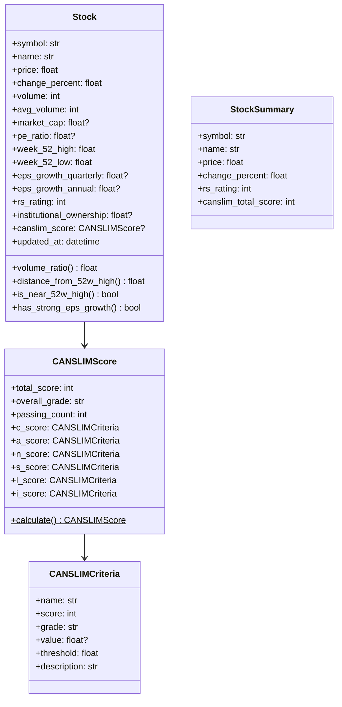
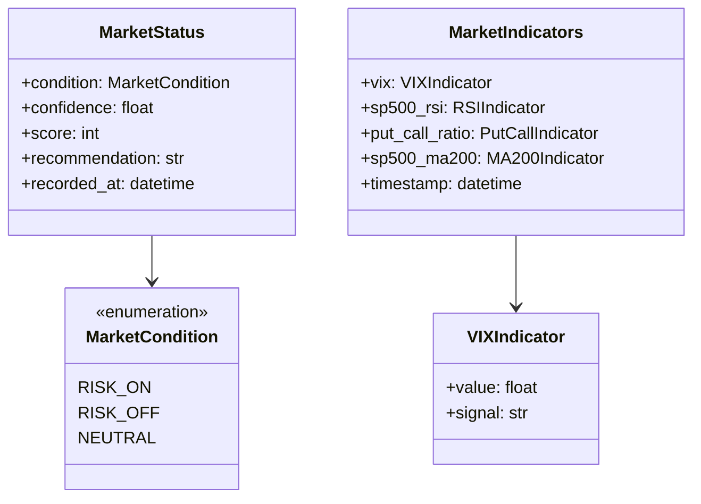
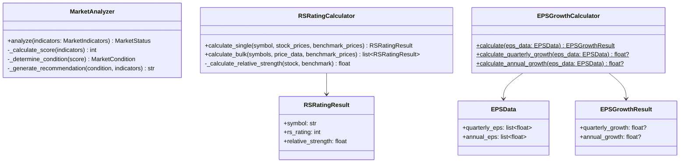
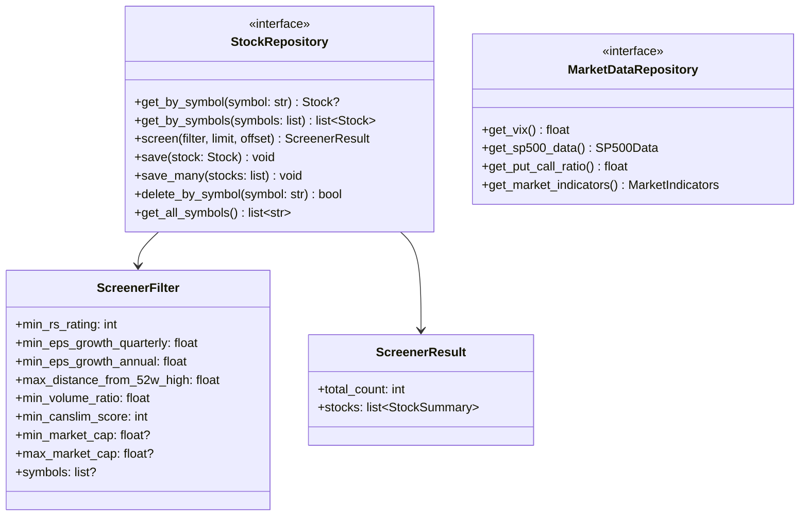
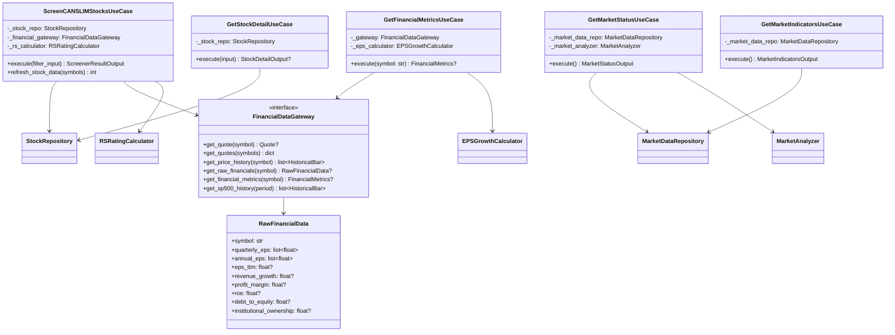
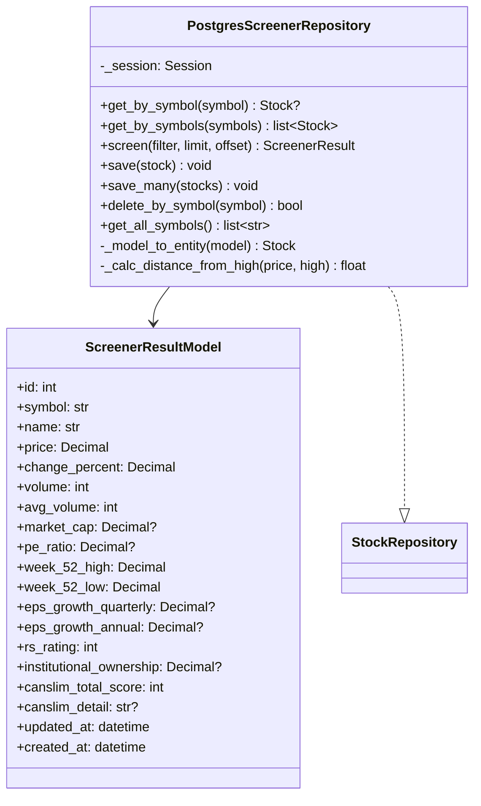
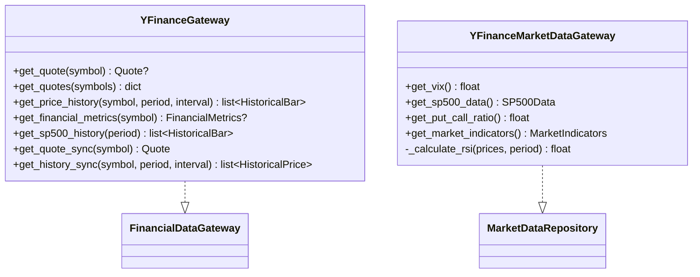
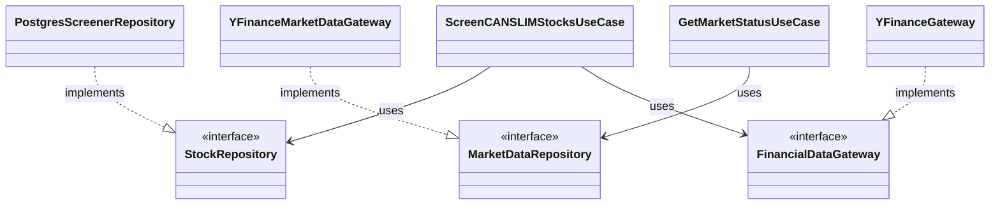

# クラス図

## 概要

主要なクラス・インターフェースの構造と関係を可視化。

---

## 1. Domain Layer

### Entities & Value Objects

### Market関連

---

## 2. Domain Services

---

## 3. Repository Interfaces

---

## 4. Application Layer (Use Cases)

---

## 5. Infrastructure Layer

### Repositories

### Gateways

---

## 6. 全体の継承・実装関係

