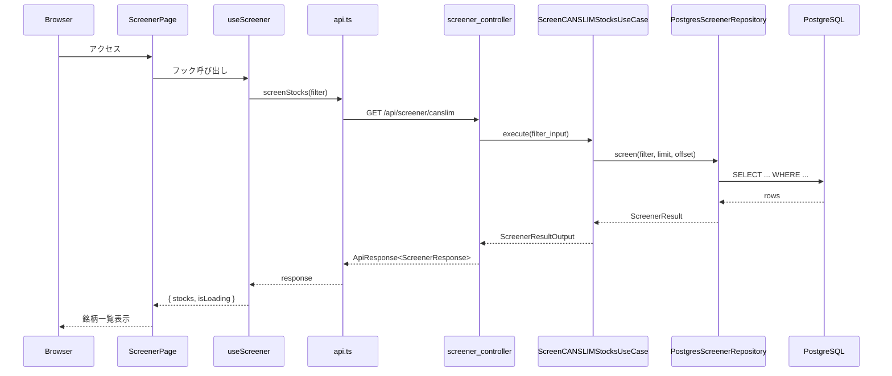
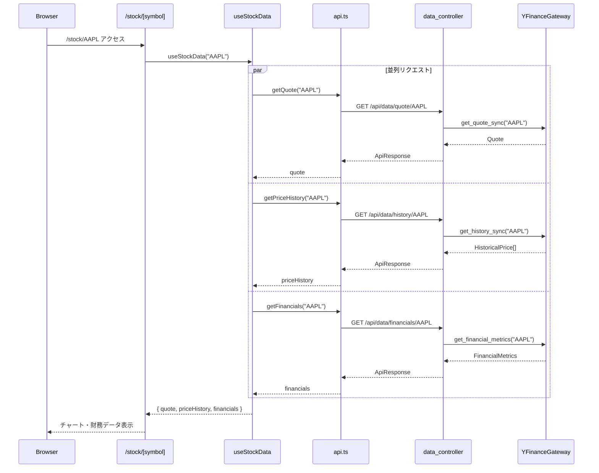
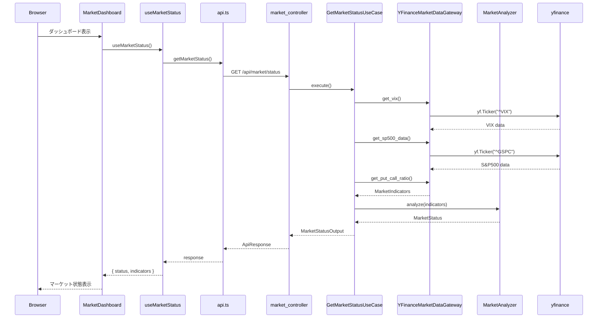
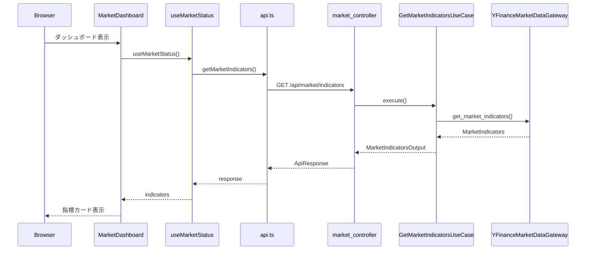
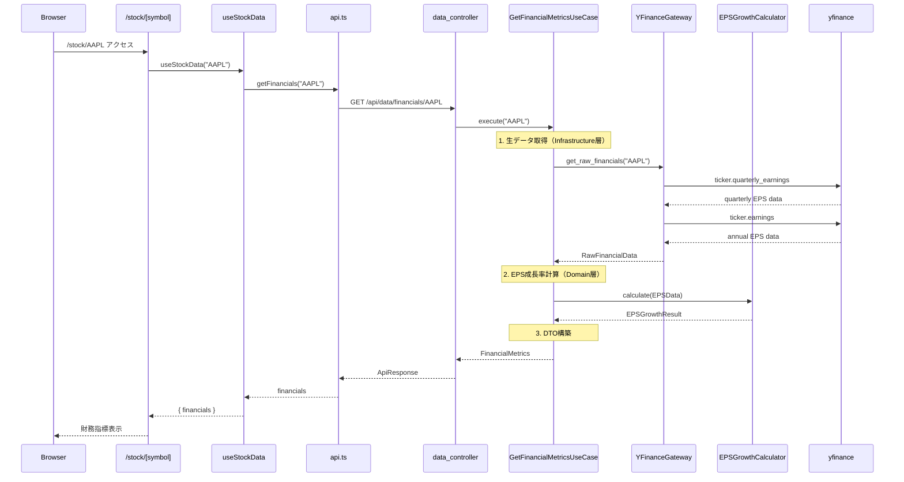

# データフロー図

## 概要

主要機能のリクエスト/レスポンスの流れをシーケンス図で可視化。

---

## 1. スクリーニング機能

`/screener` ページでCAN-SLIM条件の銘柄一覧を取得するフロー。

---

## 2. 銘柄詳細ページ

`/stock/[symbol]` ページで株価・財務データを取得するフロー。

---

## 3. マーケット状態取得

ダッシュボードでマーケット状態（Risk On/Off）を取得するフロー。

---

## 4. マーケット指標取得

個別の指標データ（VIX、RSI等）を取得するフロー。

---

## 5. 財務指標取得（リファクタリング後）

`/data/financials/{symbol}` エンドポイントでEPS成長率を含む財務指標を取得するフロー。

---

## API エンドポイント対応表

| 機能 | エンドポイント | データフロー |
|------|---------------|-------------|
| スクリーニング | `GET /api/screener/canslim` | Controller → UseCase → Repository → DB |
| 銘柄詳細 | `GET /api/screener/stock/{symbol}` | Controller → UseCase → Repository |
| 株価取得 | `GET /api/data/quote/{symbol}` | Controller → Gateway → yfinance |
| 株価履歴 | `GET /api/data/history/{symbol}` | Controller → Gateway → yfinance |
| 財務指標 | `GET /api/data/financials/{symbol}` | Controller → UseCase → Gateway → Calculator |
| マーケット状態 | `GET /api/market/status` | Controller → UseCase → Gateway → Analyzer |
| マーケット指標 | `GET /api/market/indicators` | Controller → UseCase → Gateway |
