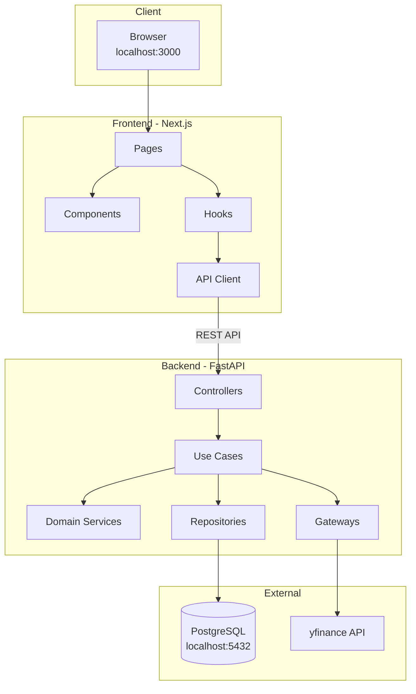
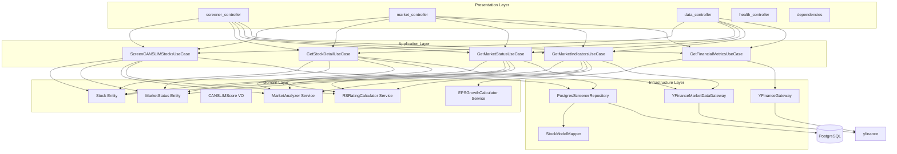
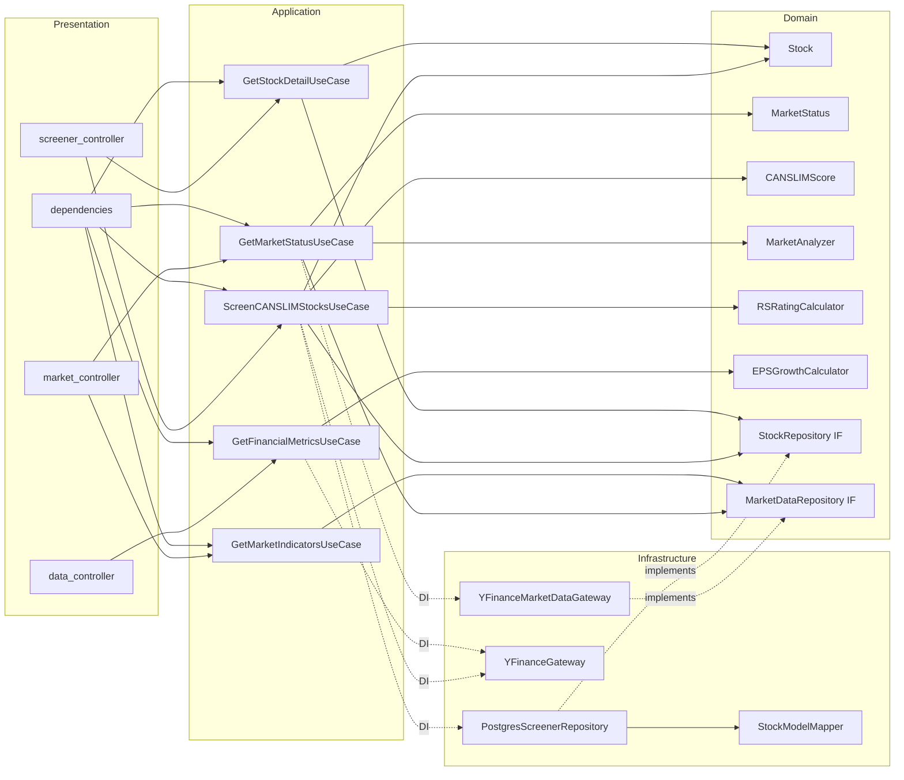
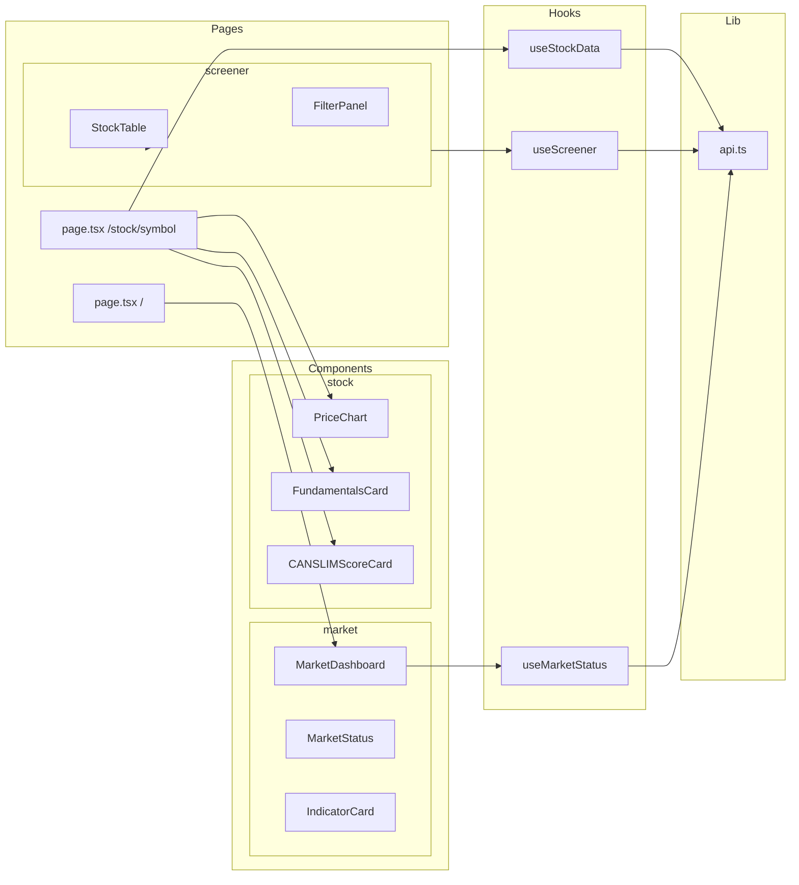

# モジュール依存関係図

## 概要

バックエンド・フロントエンドの各モジュール間の依存関係を可視化。

---

## システム全体構成

---

## バックエンド レイヤー構成

---

## バックエンド詳細依存関係

---

## フロントエンド依存関係

---

## 依存の方向

| レイヤー | 依存先 | 備考 |
|---------|--------|------|
| Presentation | Application | UseCaseを呼び出す |
| Application | Domain | Entity, VO, Serviceを使用 |
| Application | Infrastructure (via DI) | RepositoryとGatewayの実装を注入 |
| Infrastructure | Domain | Repository IFを実装 |

**依存ルール**: 外側 → 内側（Presentation → Application → Domain ← Infrastructure）
