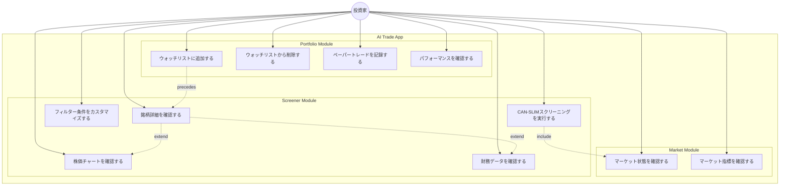
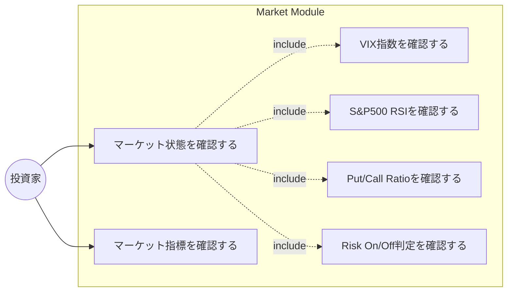
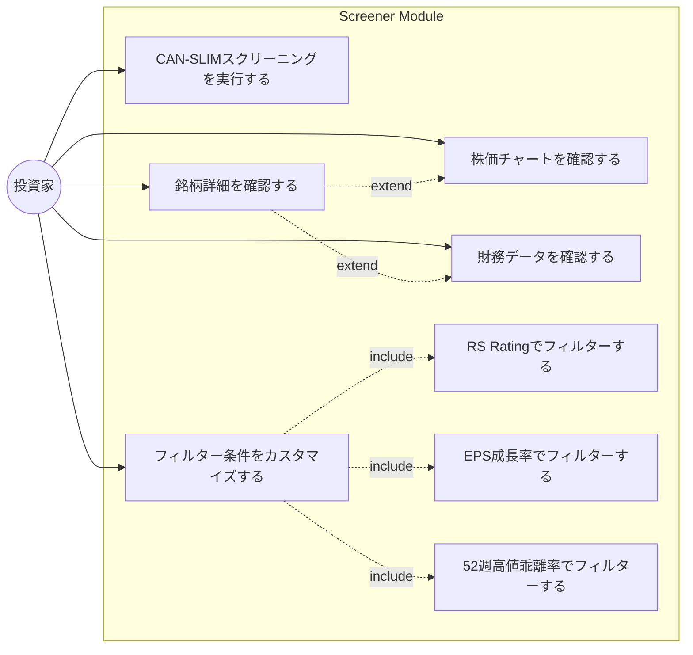
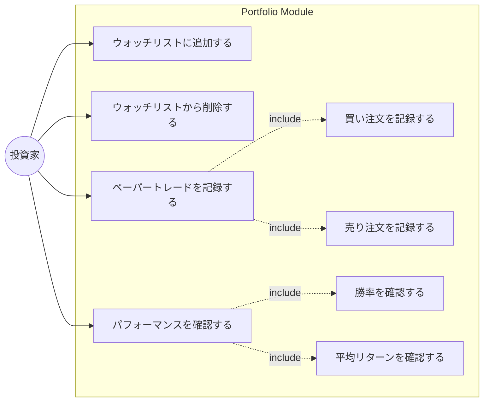

# ユースケース図

## 概要

AI Trade App（CAN-SLIM投資支援アプリケーション）のユースケース図。
投資家がシステムを利用して投資判断を行う際の主要なユースケースを定義する。

---

## アクター

| アクター | 説明 |
|---------|------|
| 投資家（Investor） | システムの主要ユーザー。CAN-SLIM手法に基づいて投資判断を行う |

---

## ユースケース図（全体）

---

## モジュール別ユースケース図

### Market Module

### Screener Module

### Portfolio Module

---

## ユースケース詳細

### UC1: マーケット状態を確認する

| 項目 | 内容 |
|------|------|
| アクター | 投資家 |
| 目的 | 現在のマーケット環境（Risk On/Off/Neutral）を把握する |
| 事前条件 | なし |
| 基本フロー | 1. ダッシュボードを開く 2. マーケット状態（Risk On/Off/Neutral）を確認する 3. 各指標のシグナルを確認する |
| 事後条件 | マーケット状態が表示される |
| 関連API | `GET /api/market/status` |

### UC2: マーケット指標を確認する

| 項目 | 内容 |
|------|------|
| アクター | 投資家 |
| 目的 | VIX、RSI、Put/Call Ratio等の詳細値を確認する |
| 事前条件 | なし |
| 基本フロー | 1. ダッシュボードを開く 2. 各指標の現在値を確認する 3. 各指標のシグナル（Bullish/Neutral/Bearish）を確認する |
| 事後条件 | マーケット指標が表示される |
| 関連API | `GET /api/market/indicators` |

### UC3: CAN-SLIMスクリーニングを実行する

| 項目 | 内容 |
|------|------|
| アクター | 投資家 |
| 目的 | CAN-SLIM条件を満たす銘柄を抽出する |
| 事前条件 | マーケット状態を確認済み（推奨） |
| 基本フロー | 1. スクリーナーページを開く 2. フィルター条件を設定する（任意） 3. スクリーニング結果を確認する 4. 銘柄をCAN-SLIMスコア順でソートする |
| 事後条件 | 条件を満たす銘柄リストが表示される |
| 関連API | `GET /api/screener/canslim` |

### UC4: フィルター条件をカスタマイズする

| 項目 | 内容 |
|------|------|
| アクター | 投資家 |
| 目的 | スクリーニング条件を調整する |
| 事前条件 | スクリーナーページを開いている |
| 基本フロー | 1. フィルターパネルを開く 2. 条件を変更する（RS Rating、EPS成長率等） 3. 結果を確認する |
| 事後条件 | 新しい条件でスクリーニング結果が更新される |
| フィルター項目 | min_rs_rating, min_eps_growth_quarterly, min_eps_growth_annual, max_distance_from_52w_high, min_volume_ratio, min_canslim_score |

### UC5: 銘柄詳細を確認する

| 項目 | 内容 |
|------|------|
| アクター | 投資家 |
| 目的 | 個別銘柄の詳細情報を確認する |
| 事前条件 | スクリーニング結果から銘柄を選択 |
| 基本フロー | 1. 銘柄シンボルをクリックする 2. 詳細ページに遷移する 3. 株価、財務指標、CAN-SLIMスコアを確認する |
| 事後条件 | 銘柄詳細ページが表示される |
| 関連API | `GET /api/screener/stock/{symbol}` |

### UC6: 株価チャートを確認する

| 項目 | 内容 |
|------|------|
| アクター | 投資家 |
| 目的 | 銘柄の株価推移をチャートで確認する |
| 事前条件 | 銘柄詳細ページを開いている |
| 基本フロー | 1. ローソク足チャートを確認する 2. 出来高を確認する 3. 52週高値/安値との位置関係を確認する |
| 事後条件 | 株価チャートが表示される |
| 関連API | `GET /api/data/history/{symbol}` |

### UC7: 財務データを確認する

| 項目 | 内容 |
|------|------|
| アクター | 投資家 |
| 目的 | 銘柄の財務指標（EPS成長率、ROE等）を確認する |
| 事前条件 | 銘柄詳細ページを開いている |
| 基本フロー | 1. EPS成長率（四半期/年間）を確認する 2. 売上成長率を確認する 3. 利益率、ROEを確認する 4. 機関投資家保有率を確認する |
| 事後条件 | 財務データが表示される |
| 関連API | `GET /api/data/financials/{symbol}` |

### UC8: ウォッチリストに追加する

| 項目 | 内容 |
|------|------|
| アクター | 投資家 |
| 目的 | 注目銘柄をウォッチリストに登録する |
| 事前条件 | 銘柄詳細を確認済み |
| 基本フロー | 1. 銘柄詳細ページで「ウォッチリストに追加」をクリック 2. 目標価格、ストップロス価格を設定（任意） 3. メモを追加（任意） 4. 追加を確定する |
| 事後条件 | 銘柄がウォッチリストに追加される |
| 関連API | `POST /api/portfolio/watchlist` |

### UC9: ウォッチリストから削除する

| 項目 | 内容 |
|------|------|
| アクター | 投資家 |
| 目的 | 不要になった銘柄をウォッチリストから削除する |
| 事前条件 | ウォッチリストに銘柄が存在する |
| 基本フロー | 1. ウォッチリストを開く 2. 削除したい銘柄の削除ボタンをクリック 3. 削除を確定する |
| 事後条件 | 銘柄がウォッチリストから削除される |
| 関連API | `DELETE /api/portfolio/watchlist/{symbol}` |

### UC10: ペーパートレードを記録する

| 項目 | 内容 |
|------|------|
| アクター | 投資家 |
| 目的 | 仮想売買を記録して投資スキルを向上させる |
| 事前条件 | ウォッチリストに銘柄が存在する |
| 基本フロー | 1. ウォッチリストから銘柄を選択 2. 売買種別（買い/売り）を選択 3. 数量と価格を入力 4. 記録を保存する |
| 事後条件 | ペーパートレードが記録される |
| 関連API | `POST /api/portfolio/trades` |

### UC11: パフォーマンスを確認する

| 項目 | 内容 |
|------|------|
| アクター | 投資家 |
| 目的 | ペーパートレードのパフォーマンスを分析する |
| 事前条件 | ペーパートレードが記録されている |
| 基本フロー | 1. ポートフォリオページを開く 2. 勝率を確認する 3. 平均リターンを確認する 4. 個別トレードの履歴を確認する |
| 事後条件 | パフォーマンス統計が表示される |
| 関連API | `GET /api/portfolio/performance` |

---

## ユースケース間の関係

### Include関係

| ベースユースケース | インクルードされるユースケース |
|------------------|------------------------------|
| マーケット状態を確認する | VIX確認, RSI確認, Put/Call確認 |
| フィルター条件をカスタマイズする | RS Rating設定, EPS成長率設定 |
| ペーパートレードを記録する | 買い注文記録, 売り注文記録 |
| パフォーマンスを確認する | 勝率計算, 平均リターン計算 |

### Extend関係

| ベースユースケース | 拡張ユースケース |
|------------------|----------------|
| 銘柄詳細を確認する | 株価チャートを確認する |
| 銘柄詳細を確認する | 財務データを確認する |

### Precedes関係

| 先行ユースケース | 後続ユースケース |
|----------------|-----------------|
| 銘柄詳細を確認する | ウォッチリストに追加する |
| CAN-SLIMスクリーニング | 銘柄詳細を確認する |

---

## API対応表

| ユースケース | HTTP Method | Endpoint |
|------------|-------------|----------|
| マーケット状態を確認する | GET | `/api/market/status` |
| マーケット指標を確認する | GET | `/api/market/indicators` |
| CAN-SLIMスクリーニングを実行する | GET | `/api/screener/canslim` |
| 銘柄詳細を確認する | GET | `/api/screener/stock/{symbol}` |
| 株価チャートを確認する | GET | `/api/data/history/{symbol}` |
| 財務データを確認する | GET | `/api/data/financials/{symbol}` |
| ウォッチリストに追加する | POST | `/api/portfolio/watchlist` |
| ウォッチリストから削除する | DELETE | `/api/portfolio/watchlist/{symbol}` |
| ペーパートレードを記録する | POST | `/api/portfolio/trades` |
| パフォーマンスを確認する | GET | `/api/portfolio/performance` |

---

## 関連ドキュメント

| ドキュメント | 内容 |
|-------------|------|
| [api-design.md](./api-design.md) | REST API設計詳細 |
| [service-components.md](./service-components.md) | サービスコンポーネント設計 |
| [../plan/plan-overview.md](../plan/plan-overview.md) | 実装フェーズ概要 |
