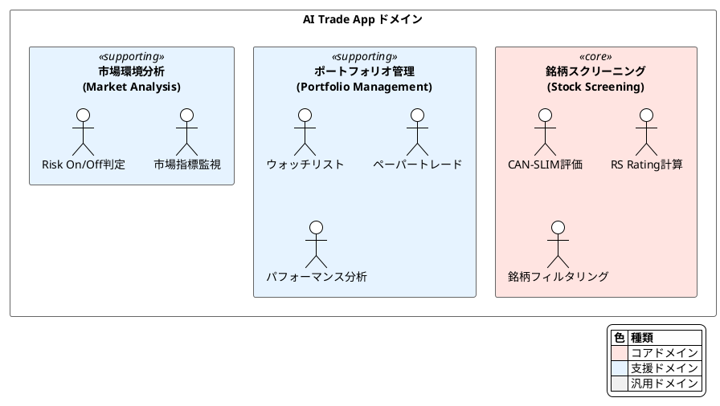

# サブドメイン分析（Subdomain Analysis）

## 目的

ビジネスドメインをサブドメインに分割し、各サブドメインの重要度と投資優先度を明確にする。

---

## ドメイン定義

**AI Trade App のドメイン:**

> 個人投資家向けの株式スクリーニング支援システム
> CAN-SLIM手法に基づき、成長株の発見・評価・管理を行う

---

## サブドメイン一覧



---

## サブドメイン詳細

### 1. 銘柄スクリーニング（Stock Screening）

| 項目 | 内容 |
|------|------|
| **種類** | コアドメイン |
| **重要度** | 最高 |
| **競争優位性** | 高（CAN-SLIM手法の独自実装） |

**責務:**
- CAN-SLIM基準に基づく銘柄評価
- RS Rating（相対強度順位）の計算
- 条件に合致する銘柄のフィルタリング
- 個別銘柄の詳細分析

**なぜコアドメインか:**
- システムの主要な価値提供
- 他サービスとの差別化ポイント
- ユーザーがこのシステムを使う理由

**投資すべきリソース:**
- 最も優秀な開発者
- 最も多くの設計時間
- 継続的な改善

---

### 2. ポートフォリオ管理（Portfolio Management）

| 項目 | 内容 |
|------|------|
| **種類** | 支援ドメイン |
| **重要度** | 中 |
| **競争優位性** | 低（一般的な機能） |

**責務:**
- ウォッチリスト（注目銘柄の追跡）
- ペーパートレード（仮想売買の記録）
- パフォーマンス分析（損益・勝率）

**なぜ支援ドメインか:**
- コアドメインを補完する機能
- 他サービスでも一般的に提供される
- 独自性は低いが必要な機能

**投資すべきリソース:**
- 標準的な実装で十分
- 既存ライブラリ・パターンの活用
- 必要最小限の機能に絞る

---

### 3. 市場環境分析（Market Analysis）

| 項目 | 内容 |
|------|------|
| **種類** | 支援ドメイン |
| **重要度** | 中 |
| **競争優位性** | 低（一般的な指標） |

**責務:**
- 市場指標の取得（VIX, RSI, 200MA等）
- Risk On/Off/Neutral の判定
- CAN-SLIMの「M」評価への入力提供

**なぜ支援ドメインか:**
- スクリーニングの判断材料を提供
- 指標自体は公開情報
- 独自のアルゴリズムは限定的

**投資すべきリソース:**
- シンプルな実装
- 外部データソースへの依存を最小化
- 判定ロジックは設定可能に

---

## サブドメイン比較

| サブドメイン | 種類 | 複雑さ | ビジネス価値 | 投資優先度 |
|------------|------|--------|------------|----------|
| 銘柄スクリーニング | コア | 高 | 高 | **最優先** |
| ポートフォリオ管理 | 支援 | 中 | 中 | 標準 |
| 市場環境分析 | 支援 | 低 | 中 | 標準 |

---

## コアドメインの深掘り

### 銘柄スクリーニングの構成要素

```plantuml
@startuml Core Domain Breakdown
!theme plain

skinparam rectangle {
    BackgroundColor #FFE4E1
}

rectangle "銘柄スクリーニング（コアドメイン）" {
    rectangle "CAN-SLIM評価" as CS {
        :C: 当期利益成長:
        :A: 年間利益成長:
        :N: 新製品・新経営:
        :S: 需給バランス:
        :L: 主導株判定:
        :I: 機関投資家:
        :M: 市場方向:
    }

    rectangle "RS Rating" as RS {
        :相対強度計算:
        :パーセンタイル順位:
    }

    rectangle "スクリーニング" as SC {
        :条件フィルタリング:
        :ソート・ランキング:
    }
}

CS --> SC : スコア提供
RS --> SC : 順位提供
RS --> CS : L評価に使用

@enduml
```

### コアドメインで守るべき原則

1. **ドメインロジックの純粋性**
   - 外部依存を排除
   - ビジネスルールをドメイン層に集約

2. **ユビキタス言語の徹底**
   - CAN-SLIM用語をコードに反映
   - ドメインエキスパートと共通の言葉

3. **テストカバレッジ**
   - ドメインロジックの高いテスト率
   - ビジネスルールの変更に追従

---

## 汎用ドメイン（将来検討）

現在は実装していないが、将来的に必要となる可能性のある汎用ドメイン:

| サブドメイン | 説明 | 実装方針 |
|------------|------|---------|
| 認証・認可 | ユーザー管理 | 外部サービス（Auth0等） |
| 通知 | アラート送信 | 外部サービス（SendGrid等） |
| ログ・監視 | 運用監視 | 外部サービス（Datadog等） |

**汎用ドメインの原則:** 自前実装せず、既存サービスを活用

---

## 更新履歴

| 日付 | 内容 |
|------|------|
| 2025-01-01 | 初版作成 |
