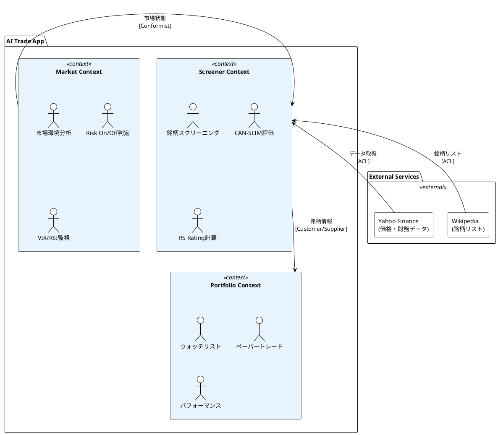

# コンテキストマップ（Context Map）

## 目的

システムを構成する境界づけられたコンテキストと、それらの関係を定義する。

---

## コンテキスト一覧



---

## 各コンテキストの責務

### 1. Screener Context（スクリーニング）

**責務:** 投資対象となる銘柄の発見・評価

| 機能 | 説明 |
|------|------|
| 銘柄スクリーニング | CAN-SLIM条件に基づくフィルタリング |
| RS Rating計算 | 相対強度のパーセンタイル順位付け |
| CAN-SLIMスコア計算 | 各評価項目の総合スコア算出 |
| 個別銘柄詳細 | 銘柄の詳細情報・評価表示 |

**集約ルート候補:**
- `ScreenedStock`（スクリーニング結果としての銘柄）

### 2. Portfolio Context（ポートフォリオ）

**責務:** ユーザーの投資活動管理

| 機能 | 説明 |
|------|------|
| ウォッチリスト | 注目銘柄の追跡 |
| ペーパートレード | 仮想売買の記録 |
| パフォーマンス | 損益・勝率の計算 |

**集約ルート候補:**
- `WatchlistItem`（ウォッチリスト項目）
- `Trade`（トレード記録）

### 3. Market Context（市場環境）

**責務:** 市場全体の状況把握

| 機能 | 説明 |
|------|------|
| 指標取得 | VIX, RSI, 200MA等の取得 |
| 状態判定 | Risk On/Off/Neutralの判定 |
| 推奨生成 | 投資アクションの推奨 |

**集約ルート候補:**
- `MarketSnapshot`（市場状態のスナップショット）

---

## コンテキスト間の関係

### Screener ← Market（Conformist）

```
Market Context が Screener Context に市場状態を提供
Screener は Market の判定結果をそのまま使用（Conformist）
```

**データフロー:**
- Market → Screener: 市場状態（Risk On/Off）
- 用途: CAN-SLIMの「M」評価に使用

### Portfolio → Screener（Customer/Supplier）

```
Portfolio Context が Screener Context の銘柄情報を参照
Portfolio は Screener が提供する形式に依存
```

**データフロー:**
- Screener → Portfolio: 銘柄情報（symbol, name, price等）
- 用途: ウォッチリストの銘柄表示、トレード対象の参照

---

## 共有カーネル（Shared Kernel）

コンテキスト間で共有される概念:

| 概念 | 説明 | 共有コンテキスト |
|------|------|----------------|
| Symbol | 銘柄識別子 | 全コンテキスト |
| Price | 株価 | Screener, Portfolio |
| Date | 日付 | 全コンテキスト |

---

## 腐敗防止層（Anti-Corruption Layer）

### External Services との境界

```plantuml
@startuml ACL
!theme plain

skinparam package {
    BackgroundColor #FAFAFA
}

package "Screener Context" {
    interface "FinancialDataGateway" as FDG {
        +get_quote()
        +get_price_history()
        +get_financial_metrics()
    }
    note right of FDG : ACL\n(腐敗防止層)
}

package "Infrastructure" {
    class "YFinanceGateway" as YFG {
        +get_quote()
        +get_price_history()
        +get_financial_metrics()
    }
}

cloud "Yahoo Finance API" as YF

FDG <|.. YFG : implements
YFG --> YF : HTTP

@enduml
```

外部サービスの変更がドメインに影響しないよう、Gateway層で変換する。

---

## 更新履歴

| 日付 | 内容 |
|------|------|
| 2025-01-01 | 初版作成 |
