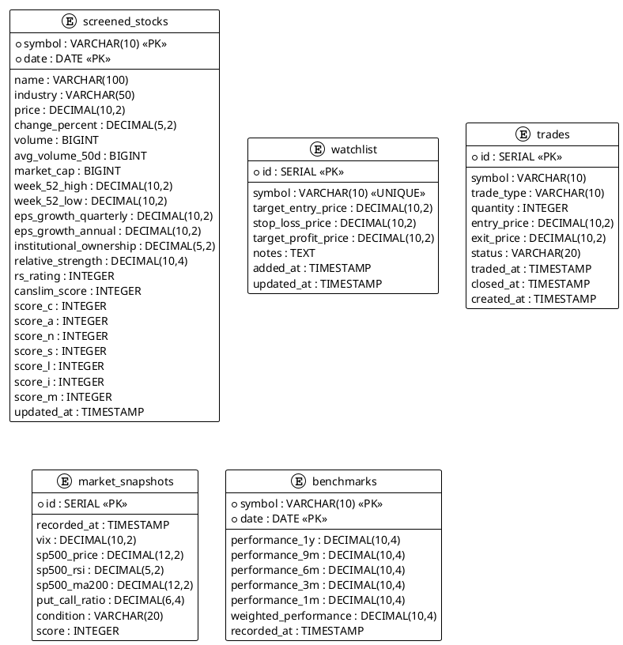

# データベース設計

## 概要

ドメインモデルに基づくDBスキーマ設計。SQLアンチパターンを回避しつつ、シンプルさを優先する。

---

## 設計原則

| 原則 | 適用 |
|------|------|
| 1集約 = 1テーブル | ScreenedStock, Trade 等 |
| 複合主キー優先 | 不要なサロゲートキーを避ける |
| FK制約明示 | 参照整合性を保証 |
| 過剰な正規化を避ける | JOINを減らす |

---

## ER図



---

## テーブル定義

### 1. screened_stocks（Screener Context）

**ドメインモデル:** ScreenedStock 集約

```sql
CREATE TABLE screened_stocks (
    -- 主キー（複合）
    symbol VARCHAR(10) NOT NULL,
    date DATE NOT NULL,

    -- 銘柄情報
    name VARCHAR(100),
    industry VARCHAR(50),

    -- 価格データ（PriceSnapshot）
    price DECIMAL(10,2),
    change_percent DECIMAL(5,2),
    volume BIGINT,
    avg_volume_50d BIGINT,
    market_cap BIGINT,
    week_52_high DECIMAL(10,2),
    week_52_low DECIMAL(10,2),

    -- 財務データ
    eps_growth_quarterly DECIMAL(10,2),
    eps_growth_annual DECIMAL(10,2),
    institutional_ownership DECIMAL(5,2),

    -- RS関連（StockRating）
    relative_strength DECIMAL(10,4),
    rs_rating INTEGER,

    -- CAN-SLIMスコア（CANSLIMScore）
    canslim_score INTEGER,
    score_c INTEGER,
    score_a INTEGER,
    score_n INTEGER,
    score_s INTEGER,
    score_l INTEGER,
    score_i INTEGER,
    score_m INTEGER,

    -- メタデータ
    updated_at TIMESTAMP NOT NULL DEFAULT CURRENT_TIMESTAMP,

    -- 制約
    PRIMARY KEY (symbol, date),
    CONSTRAINT valid_rs_rating CHECK (rs_rating IS NULL OR rs_rating BETWEEN 1 AND 99),
    CONSTRAINT valid_canslim CHECK (canslim_score IS NULL OR canslim_score BETWEEN 0 AND 100)
);

-- インデックス
CREATE INDEX idx_screened_stocks_date ON screened_stocks(date);
CREATE INDEX idx_screened_stocks_rs ON screened_stocks(rs_rating DESC)
    WHERE rs_rating IS NOT NULL;
CREATE INDEX idx_screened_stocks_canslim ON screened_stocks(canslim_score DESC)
    WHERE canslim_score IS NOT NULL;

COMMENT ON TABLE screened_stocks IS 'スクリーニング対象銘柄（1集約 = 1テーブル）';
```

---

### 2. watchlist（Portfolio Context）

**ドメインモデル:** WatchlistItem 集約

```sql
CREATE TABLE watchlist (
    id SERIAL PRIMARY KEY,
    symbol VARCHAR(10) NOT NULL UNIQUE,

    -- 目標価格
    target_entry_price DECIMAL(10,2),
    stop_loss_price DECIMAL(10,2),
    target_profit_price DECIMAL(10,2),

    -- メモ
    notes TEXT,

    -- タイムスタンプ
    added_at TIMESTAMP NOT NULL DEFAULT CURRENT_TIMESTAMP,
    updated_at TIMESTAMP NOT NULL DEFAULT CURRENT_TIMESTAMP
);

CREATE INDEX idx_watchlist_symbol ON watchlist(symbol);

COMMENT ON TABLE watchlist IS 'ウォッチリスト';
```

---

### 3. trades（Portfolio Context）

**ドメインモデル:** Trade 集約

```sql
CREATE TABLE trades (
    id SERIAL PRIMARY KEY,
    symbol VARCHAR(10) NOT NULL,

    -- トレード情報
    trade_type VARCHAR(10) NOT NULL,
    quantity INTEGER NOT NULL,
    entry_price DECIMAL(10,2) NOT NULL,
    exit_price DECIMAL(10,2),

    -- ステータス
    status VARCHAR(20) NOT NULL DEFAULT 'open',

    -- タイムスタンプ
    traded_at TIMESTAMP NOT NULL,
    closed_at TIMESTAMP,
    created_at TIMESTAMP NOT NULL DEFAULT CURRENT_TIMESTAMP,

    -- 制約
    CONSTRAINT valid_trade_type CHECK (trade_type IN ('buy', 'sell')),
    CONSTRAINT valid_status CHECK (status IN ('open', 'closed', 'cancelled')),
    CONSTRAINT positive_quantity CHECK (quantity > 0),
    CONSTRAINT positive_entry CHECK (entry_price > 0)
);

CREATE INDEX idx_trades_symbol ON trades(symbol);
CREATE INDEX idx_trades_status ON trades(status);
CREATE INDEX idx_trades_traded_at ON trades(traded_at DESC);

COMMENT ON TABLE trades IS 'ペーパートレード';
```

---

### 4. market_snapshots（Market Context）

**ドメインモデル:** MarketSnapshot 集約

```sql
CREATE TABLE market_snapshots (
    id SERIAL PRIMARY KEY,
    recorded_at TIMESTAMP NOT NULL,

    -- 指標
    vix DECIMAL(10,2) NOT NULL,
    sp500_price DECIMAL(12,2) NOT NULL,
    sp500_rsi DECIMAL(5,2) NOT NULL,
    sp500_ma200 DECIMAL(12,2) NOT NULL,
    put_call_ratio DECIMAL(6,4) NOT NULL,

    -- 判定結果
    condition VARCHAR(20) NOT NULL,
    score INTEGER NOT NULL,

    -- 制約
    CONSTRAINT valid_condition CHECK (condition IN ('risk_on', 'neutral', 'risk_off')),
    CONSTRAINT valid_score CHECK (score BETWEEN -5 AND 5)
);

CREATE INDEX idx_market_snapshots_recorded ON market_snapshots(recorded_at DESC);

COMMENT ON TABLE market_snapshots IS '市場状態スナップショット';
```

---

### 5. benchmarks（Market Context）

**ドメインモデル:** Benchmark 集約

```sql
CREATE TABLE benchmarks (
    symbol VARCHAR(10) NOT NULL,
    date DATE NOT NULL,

    -- パフォーマンス
    performance_1y DECIMAL(10,4),
    performance_9m DECIMAL(10,4),
    performance_6m DECIMAL(10,4),
    performance_3m DECIMAL(10,4),
    performance_1m DECIMAL(10,4),
    weighted_performance DECIMAL(10,4),

    -- メタデータ
    recorded_at TIMESTAMP NOT NULL DEFAULT CURRENT_TIMESTAMP,

    PRIMARY KEY (symbol, date)
);

CREATE INDEX idx_benchmarks_symbol_date ON benchmarks(symbol, date DESC);

COMMENT ON TABLE benchmarks IS '市場ベンチマーク（S&P500, NASDAQ100）';
```

---

## 現行テーブルとの比較

| 現行 | 新設計 | 変更点 |
|------|--------|--------|
| stocks | 廃止 | screened_stocks に統合 |
| stock_prices | 廃止 | screened_stocks に統合 |
| stock_metrics | 廃止 | screened_stocks に統合 |
| screener_results | 廃止 | screened_stocks に置換 |
| watchlist | watchlist | 変更なし |
| paper_trades | trades | リネーム |
| market_snapshots | market_snapshots | 一部カラム削除 |
| market_benchmarks | benchmarks | リネーム、複合PK |
| price_cache | 検討中 | 別途判断 |
| job_executions | 維持 | 変更なし |

---

## SQLアンチパターン対策

| アンチパターン | 対策 | 実装 |
|---------------|------|------|
| IDリクワイアド | 複合主キー | screened_stocks, benchmarks |
| キーレスエントリ | FK制約 | （screened_stocks は単独で完結）|
| EAV | 個別カラム | score_c, score_a, ... |
| 過剰な正規化 | テーブル統合 | 3テーブル → 1テーブル |
| スパゲッティクエリ | JOINなし | screened_stocks 単独でクエリ完結 |

---

## マイグレーション方針

### 方針: クリーンスタート

開発フェーズのため、マイグレーションスクリプトは使用せず、コンテナ再作成で対応。

```bash
# 既存コンテナとボリュームを削除
docker-compose down -v

# 新スキーマで再作成
docker-compose up -d
```

### 作業手順

1. `backend/src/infrastructure/database/init.sql` を新スキーマに更新
2. Docker コンテナを再作成
3. 動作確認

---

## 更新履歴

| 日付 | 内容 |
|------|------|
| 2025-01-01 | 初版作成 |
