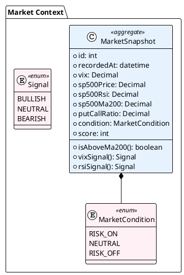
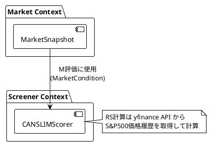

# Market Context - 集約設計

## 概要

支援ドメインである市場環境分析の集約・エンティティ・値オブジェクトを定義する。

**設計方針:** 支援ドメインのため、シンプルさを優先。Screener Context への入力提供が主目的。

---

## 集約一覧



---

## 集約1: MarketSnapshot

### 定義

市場全体の状態を表すスナップショット。VIX、S&P500指標、Put/Call Ratio から総合判定を行う。

### 責務

- 市場指標の保持
- Risk On/Off/Neutral の判定
- CAN-SLIM「M」評価への入力提供

### 不変条件

1. vix >= 0
2. sp500Rsi は 0-100 の範囲
3. condition は指標から導出される

### コード例

```python
class MarketCondition(Enum):
    RISK_ON = "risk_on"
    NEUTRAL = "neutral"
    RISK_OFF = "risk_off"

class Signal(Enum):
    BULLISH = "bullish"
    NEUTRAL = "neutral"
    BEARISH = "bearish"

@dataclass
class MarketSnapshot:
    """市場状態スナップショット（集約ルート）"""

    id: int
    recorded_at: datetime
    vix: Decimal
    sp500_price: Decimal
    sp500_rsi: Decimal
    sp500_ma200: Decimal
    put_call_ratio: Decimal
    condition: MarketCondition
    score: int  # -5 〜 +5

    def is_above_ma200(self) -> bool:
        """S&P500が200日移動平均線より上か"""
        return self.sp500_price > self.sp500_ma200

    def vix_signal(self) -> Signal:
        """VIXシグナル判定"""
        if self.vix < 15:
            return Signal.BULLISH
        elif self.vix > 25:
            return Signal.BEARISH
        return Signal.NEUTRAL

    def rsi_signal(self) -> Signal:
        """RSIシグナル判定"""
        if self.sp500_rsi > 70:
            return Signal.BEARISH  # 買われすぎ
        elif self.sp500_rsi < 30:
            return Signal.BULLISH  # 売られすぎ
        return Signal.NEUTRAL

    def put_call_signal(self) -> Signal:
        """Put/Call Ratioシグナル判定"""
        if self.put_call_ratio > 1.0:
            return Signal.BULLISH  # 逆張り指標
        elif self.put_call_ratio < 0.7:
            return Signal.BEARISH
        return Signal.NEUTRAL
```

---

## ドメインサービス: MarketAnalyzer

Market Context には1つのドメインサービスを定義。

```python
class MarketAnalyzer:
    """市場分析サービス"""

    def analyze(
        self,
        vix: Decimal,
        sp500_price: Decimal,
        sp500_rsi: Decimal,
        sp500_ma200: Decimal,
        put_call_ratio: Decimal,
    ) -> MarketSnapshot:
        """
        市場指標から総合判定を行い、MarketSnapshot を生成

        Returns:
            MarketSnapshot（condition, score を含む）
        """
        score = 0

        # VIX評価
        if vix < 15:
            score += 1
        elif vix > 25:
            score -= 2

        # RSI評価
        if 30 <= sp500_rsi <= 70:
            score += 1
        elif sp500_rsi > 70:
            score -= 1

        # 200MA評価
        if sp500_price > sp500_ma200:
            score += 2
        else:
            score -= 2

        # Put/Call評価
        if put_call_ratio > 1.0:
            score += 1
        elif put_call_ratio < 0.7:
            score -= 1

        # 総合判定
        if score >= 2:
            condition = MarketCondition.RISK_ON
        elif score <= -2:
            condition = MarketCondition.RISK_OFF
        else:
            condition = MarketCondition.NEUTRAL

        return MarketSnapshot(
            id=0,  # リポジトリで採番
            recorded_at=datetime.now(),
            vix=vix,
            sp500_price=sp500_price,
            sp500_rsi=sp500_rsi,
            sp500_ma200=sp500_ma200,
            put_call_ratio=put_call_ratio,
            condition=condition,
            score=score,
        )
```

---

## リポジトリインターフェース

```python
class MarketSnapshotRepository(ABC):
    """市場スナップショットリポジトリ"""

    @abstractmethod
    def find_latest(self) -> MarketSnapshot | None:
        pass

    @abstractmethod
    def save(self, snapshot: MarketSnapshot) -> None:
        pass


```

---

## Screener Context との連携



| 提供先 | 提供データ | 用途 |
|-------|-----------|------|
| CANSLIMScorer | MarketCondition | CAN-SLIM「M」評価 |

---

## 設計判断

### シンプルさの維持

支援ドメインのため、以下は意図的に省略：

- 複雑な値オブジェクト
- 履歴管理（最新のみ保持で十分）
- 詳細な状態遷移

### Screener への依存方向

```
Market Context → Screener Context（データ提供）
```

Screener が Market に依存する形（Conformist パターン）

---

## 更新履歴

| 日付 | 内容 |
|------|------|
| 2025-01-01 | 初版作成 |
| 2025-01-01 | Benchmark 集約を削除（API から都度取得）|
