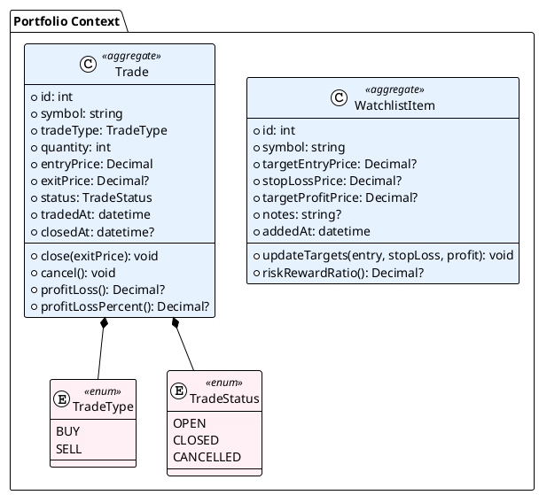

# Portfolio Context - 集約設計

## 概要

支援ドメインであるポートフォリオ管理の集約・エンティティ・値オブジェクトを定義する。

**設計方針:** 支援ドメインのため、シンプルさを優先。過度な抽象化は避ける。

---

## 集約一覧



---

## 集約1: WatchlistItem

### 定義

ウォッチリストに登録された銘柄。エントリー目標やストップロスを設定できる。

### 責務

- 目標価格の管理
- リスクリワード比の計算

### 不変条件

1. symbol は必須かつ一意
2. stopLossPrice < targetEntryPrice < targetProfitPrice（設定時）

### コード例

```python
@dataclass
class WatchlistItem:
    """ウォッチリスト項目（集約ルート）"""

    id: int
    symbol: str
    target_entry_price: Decimal | None = None
    stop_loss_price: Decimal | None = None
    target_profit_price: Decimal | None = None
    notes: str | None = None
    added_at: datetime = field(default_factory=datetime.now)

    def update_targets(
        self,
        entry: Decimal | None,
        stop_loss: Decimal | None,
        profit: Decimal | None,
    ) -> None:
        """目標価格を更新"""
        if stop_loss and entry and stop_loss >= entry:
            raise ValueError("Stop loss must be below entry price")
        if profit and entry and profit <= entry:
            raise ValueError("Target profit must be above entry price")

        self.target_entry_price = entry
        self.stop_loss_price = stop_loss
        self.target_profit_price = profit

    def risk_reward_ratio(self) -> Decimal | None:
        """リスクリワード比を計算"""
        if not all([self.target_entry_price, self.stop_loss_price, self.target_profit_price]):
            return None

        risk = self.target_entry_price - self.stop_loss_price
        reward = self.target_profit_price - self.target_entry_price

        if risk <= 0:
            return None

        return reward / risk
```

---

## 集約2: Trade

### 定義

ペーパートレード（仮想売買）の記録。

### 責務

- トレードのライフサイクル管理（Open → Closed/Cancelled）
- 損益計算

### 不変条件

1. quantity > 0
2. entryPrice > 0
3. status が OPEN のときのみ close/cancel 可能
4. exitPrice は status が CLOSED のときのみ設定

### コード例

```python
class TradeType(Enum):
    BUY = "buy"
    SELL = "sell"

class TradeStatus(Enum):
    OPEN = "open"
    CLOSED = "closed"
    CANCELLED = "cancelled"

@dataclass
class Trade:
    """ペーパートレード（集約ルート）"""

    id: int
    symbol: str
    trade_type: TradeType
    quantity: int
    entry_price: Decimal
    status: TradeStatus = TradeStatus.OPEN
    exit_price: Decimal | None = None
    traded_at: datetime = field(default_factory=datetime.now)
    closed_at: datetime | None = None

    def __post_init__(self):
        if self.quantity <= 0:
            raise ValueError("Quantity must be positive")
        if self.entry_price <= 0:
            raise ValueError("Entry price must be positive")

    def close(self, exit_price: Decimal) -> None:
        """トレードを決済"""
        if self.status != TradeStatus.OPEN:
            raise ValueError("Can only close open trades")
        if exit_price <= 0:
            raise ValueError("Exit price must be positive")

        self.exit_price = exit_price
        self.status = TradeStatus.CLOSED
        self.closed_at = datetime.now()

    def cancel(self) -> None:
        """トレードをキャンセル"""
        if self.status != TradeStatus.OPEN:
            raise ValueError("Can only cancel open trades")

        self.status = TradeStatus.CANCELLED
        self.closed_at = datetime.now()

    def profit_loss(self) -> Decimal | None:
        """損益額を計算"""
        if self.status != TradeStatus.CLOSED or self.exit_price is None:
            return None

        if self.trade_type == TradeType.BUY:
            return (self.exit_price - self.entry_price) * self.quantity
        else:  # SELL
            return (self.entry_price - self.exit_price) * self.quantity

    def profit_loss_percent(self) -> Decimal | None:
        """損益率を計算"""
        if self.status != TradeStatus.CLOSED or self.exit_price is None:
            return None

        if self.trade_type == TradeType.BUY:
            return (self.exit_price - self.entry_price) / self.entry_price * 100
        else:  # SELL
            return (self.entry_price - self.exit_price) / self.entry_price * 100
```

---

## リポジトリインターフェース

```python
class WatchlistRepository(ABC):
    """ウォッチリストリポジトリ"""

    @abstractmethod
    def find_by_symbol(self, symbol: str) -> WatchlistItem | None:
        pass

    @abstractmethod
    def find_all(self) -> list[WatchlistItem]:
        pass

    @abstractmethod
    def save(self, item: WatchlistItem) -> None:
        pass

    @abstractmethod
    def delete(self, symbol: str) -> None:
        pass


class TradeRepository(ABC):
    """トレードリポジトリ"""

    @abstractmethod
    def find_by_id(self, trade_id: int) -> Trade | None:
        pass

    @abstractmethod
    def find_open_positions(self) -> list[Trade]:
        pass

    @abstractmethod
    def find_by_symbol(self, symbol: str) -> list[Trade]:
        pass

    @abstractmethod
    def find_closed(self, limit: int = 50) -> list[Trade]:
        pass

    @abstractmethod
    def save(self, trade: Trade) -> None:
        pass
```

---

## 設計判断

### なぜ2つの集約に分けたか

| 集約 | 理由 |
|------|------|
| WatchlistItem | 「監視」と「売買」は異なるライフサイクル |
| Trade | トレードは独立した状態遷移を持つ |

### シンプルさの維持

支援ドメインのため、以下は意図的に省略：

- 値オブジェクトの過度な分割（Money, Percentage等）
- ドメインサービス（パフォーマンス計算はユースケース層で実装）
- 複雑な状態遷移（状態パターン等）

---

## 更新履歴

| 日付 | 内容 |
|------|------|
| 2025-01-01 | 初版作成 |
