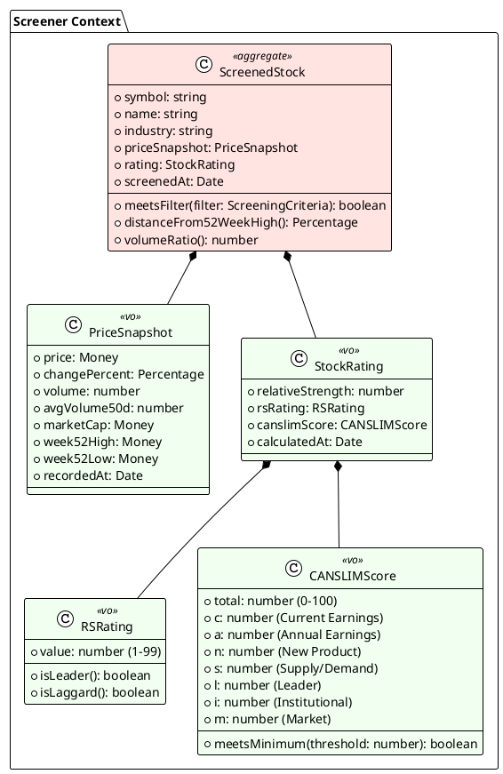

# Screener Context - 集約設計

## 概要

コアドメインである銘柄スクリーニングの集約・エンティティ・値オブジェクトを定義する。

---

## 集約一覧



---

## 集約ルート: ScreenedStock

### 定義

スクリーニング対象となる銘柄の集約ルート。価格情報と評価情報を含む。

### 責務

- スクリーニング条件との照合
- 銘柄の状態判定（52週高値乖離率、出来高倍率等）

### 不変条件（Invariants）

1. symbol は必須かつ一意（1-10文字の英大文字）
2. PriceSnapshot と StockRating は同じ日付のデータ
3. RSRating は 1-99 の範囲
4. CANSLIMScore は 0-100 の範囲

### コード例

```python
@dataclass
class ScreenedStock:
    """スクリーニング対象銘柄（集約ルート）"""

    symbol: str  # ティッカーシンボル（例: "AAPL"）
    name: str
    industry: str
    price_snapshot: PriceSnapshot
    rating: StockRating
    screened_at: date

    def meets_filter(self, criteria: ScreeningCriteria) -> bool:
        """スクリーニング条件を満たすか判定"""
        if self.rating.rs_rating.value < criteria.min_rs_rating:
            return False
        if self.rating.canslim_score.total < criteria.min_canslim_score:
            return False
        if self.distance_from_52week_high() > criteria.max_distance_from_high:
            return False
        return True

    def distance_from_52week_high(self) -> Percentage:
        """52週高値からの乖離率"""
        high = self.price_snapshot.week_52_high
        current = self.price_snapshot.price
        return Percentage((high - current) / high * 100)

    def volume_ratio(self) -> float:
        """出来高倍率（当日出来高 / 50日平均）"""
        return self.price_snapshot.volume / self.price_snapshot.avg_volume_50d
```

---

## 値オブジェクト

### PriceSnapshot（価格スナップショット）

| 属性 | 型 | 説明 |
|------|-----|------|
| price | Decimal | 現在価格 |
| change_percent | Decimal | 前日比変動率（%） |
| volume | int | 当日出来高 |
| avg_volume_50d | int | 50日平均出来高 |
| market_cap | int | 時価総額 |
| week_52_high | Decimal | 52週高値 |
| week_52_low | Decimal | 52週安値 |
| recorded_at | datetime | 記録日時 |

```python
@dataclass(frozen=True)
class PriceSnapshot:
    """価格スナップショット"""
    price: Decimal
    change_percent: Decimal
    volume: int
    avg_volume_50d: int
    market_cap: int
    week_52_high: Decimal
    week_52_low: Decimal
    recorded_at: datetime
```

---

### RSRating（RS Rating）

| 属性 | 型 | 説明 |
|------|-----|------|
| value | int | パーセンタイル順位（1-99） |

**ドメインロジック:**
- 80以上: Leader（主導株）
- 50未満: Laggard（出遅れ株）

```python
@dataclass(frozen=True)
class RSRating:
    """RS Rating（相対強度順位）"""
    value: int

    def __post_init__(self):
        if not 1 <= self.value <= 99:
            raise ValueError("RS Rating must be between 1 and 99")

    def is_leader(self) -> bool:
        """主導株か（RS 80以上）"""
        return self.value >= 80

    def is_laggard(self) -> bool:
        """出遅れ株か（RS 50未満）"""
        return self.value < 50
```

---

### CANSLIMScore（CAN-SLIMスコア）

| 属性 | 型 | 説明 |
|------|-----|------|
| total | int | 総合スコア（0-100） |
| c | int | Current Earnings |
| a | int | Annual Earnings |
| n | int | New Product/Management |
| s | int | Supply/Demand |
| l | int | Leader/Laggard |
| i | int | Institutional Sponsorship |
| m | int | Market Direction |

```python
@dataclass(frozen=True)
class CANSLIMScore:
    """CAN-SLIMスコア"""
    total: int
    c: int  # Current Earnings
    a: int  # Annual Earnings
    n: int  # New Product
    s: int  # Supply/Demand
    l: int  # Leader
    i: int  # Institutional
    m: int  # Market

    def __post_init__(self):
        if not 0 <= self.total <= 100:
            raise ValueError("Total score must be between 0 and 100")

    def meets_minimum(self, threshold: int) -> bool:
        """最低スコアを満たすか"""
        return self.total >= threshold
```

---

### StockRating（銘柄評価）

| 属性 | 型 | 説明 |
|------|-----|------|
| relative_strength | Decimal | 相対強度（生値） |
| rs_rating | RSRating | RS Rating |
| canslim_score | CANSLIMScore | CAN-SLIMスコア |
| calculated_at | datetime | 計算日時 |

```python
@dataclass(frozen=True)
class StockRating:
    """銘柄評価"""
    relative_strength: Decimal
    rs_rating: RSRating
    canslim_score: CANSLIMScore
    calculated_at: datetime
```

---

### ScreeningCriteria（スクリーニング条件）

| 属性 | 型 | デフォルト | 説明 |
|------|-----|-----------|------|
| min_rs_rating | int | 80 | 最低RS Rating |
| min_canslim_score | int | 70 | 最低CAN-SLIMスコア |
| min_eps_growth_quarterly | Decimal | 25.0 | 最低四半期EPS成長率 |
| min_eps_growth_annual | Decimal | 25.0 | 最低年間EPS成長率 |
| max_distance_from_high | Decimal | 15.0 | 52週高値乖離率上限 |
| min_volume_ratio | Decimal | 1.5 | 最低出来高倍率 |

```python
@dataclass(frozen=True)
class ScreeningCriteria:
    """スクリーニング条件（値オブジェクト）"""
    min_rs_rating: int = 80
    min_canslim_score: int = 70
    min_eps_growth_quarterly: Decimal = Decimal("25.0")
    min_eps_growth_annual: Decimal = Decimal("25.0")
    max_distance_from_high: Decimal = Decimal("15.0")
    min_volume_ratio: Decimal = Decimal("1.5")
```

---

## 設計判断

### なぜ ScreenedStock を集約ルートにしたか

1. **スクリーニングのユースケースに最適化**
   - 価格と評価は常に一緒に使用される
   - フィルタリング判定は集約内で完結

2. **トランザクション境界が明確**
   - 1銘柄のデータは一括で更新
   - 部分更新は発生しない

3. **クエリが単純化**
   - JOINなしで取得可能
   - パフォーマンス向上

### 懸念点と対策

| 懸念 | 対策 |
|------|------|
| データが大きくなる | 日次で上書き（履歴は別管理） |
| 価格と評価の更新タイミングが違う | Job完了後に一括更新 |
| 全銘柄のRS計算が必要 | ドメインサービスで対応 |

---

## 更新履歴

| 日付 | 内容 |
|------|------|
| 2025-01-01 | 初版作成 |
