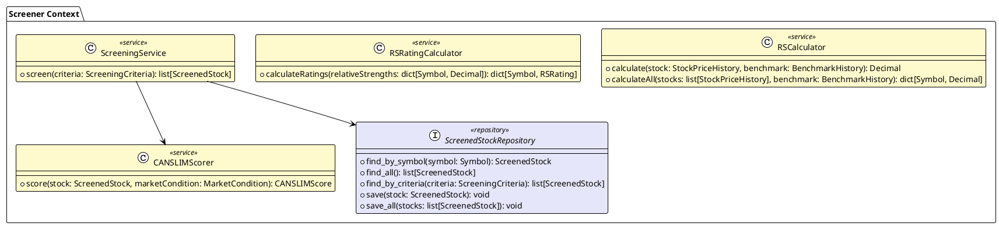
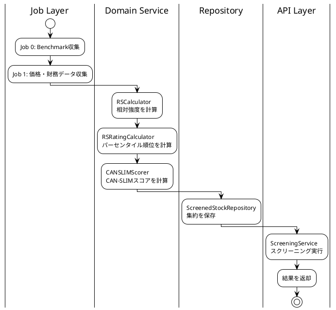

# Screener Context - ドメインサービス設計

## 概要

単一の集約に属さないドメインロジックをドメインサービスとして定義する。

---

## ドメインサービス一覧



---

## 1. RSCalculator

### 責務

個別銘柄の相対強度（Relative Strength）を計算する。

### なぜドメインサービスか

- 銘柄の価格履歴とベンチマーク（S&P500）の両方が必要
- 単一のScreenedStock集約に閉じない計算

### インターフェース

```python
class RSCalculator:
    """相対強度計算サービス"""

    def calculate(
        self,
        stock_history: StockPriceHistory,
        benchmark_history: BenchmarkHistory,
    ) -> Decimal:
        """
        個別銘柄の相対強度を計算

        計算式（IBD式加重）:
            RS = (3M×40% + 6M×20% + 9M×20% + 12M×20%) / Benchmark同期間

        Args:
            stock_history: 銘柄の価格履歴（1年分）
            benchmark_history: S&P500の価格履歴（1年分）

        Returns:
            相対強度（1.0 = ベンチマークと同等）
        """
        pass

    def calculate_all(
        self,
        stocks: list[StockPriceHistory],
        benchmark: BenchmarkHistory,
    ) -> dict[Symbol, Decimal]:
        """全銘柄の相対強度を一括計算"""
        pass
```

### 計算ロジック

```python
def _calculate_weighted_performance(self, history: PriceHistory) -> Decimal:
    """IBD式加重パフォーマンス"""
    perf_3m = self._performance(history, months=3)
    perf_6m = self._performance(history, months=6)
    perf_9m = self._performance(history, months=9)
    perf_12m = self._performance(history, months=12)

    return (
        perf_3m * Decimal("0.4") +
        perf_6m * Decimal("0.2") +
        perf_9m * Decimal("0.2") +
        perf_12m * Decimal("0.2")
    )
```

---

## 2. RSRatingCalculator

### 責務

全銘柄の相対強度からパーセンタイル順位（RS Rating 1-99）を計算する。

### なぜドメインサービスか

- **全銘柄のデータが必要**（パーセンタイル計算）
- 単一の集約では完結しない

### インターフェース

```python
class RSRatingCalculator:
    """RS Rating計算サービス"""

    def calculate_ratings(
        self,
        relative_strengths: dict[Symbol, Decimal],
    ) -> dict[Symbol, RSRating]:
        """
        全銘柄のRS Ratingを計算

        Args:
            relative_strengths: 銘柄ごとの相対強度

        Returns:
            銘柄ごとのRS Rating（1-99パーセンタイル）
        """
        pass
```

### 計算ロジック

```python
def calculate_ratings(
    self,
    relative_strengths: dict[Symbol, Decimal],
) -> dict[Symbol, RSRating]:
    """パーセンタイル計算"""
    # 相対強度でソート
    sorted_symbols = sorted(
        relative_strengths.keys(),
        key=lambda s: relative_strengths[s]
    )

    total = len(sorted_symbols)
    ratings = {}

    for rank, symbol in enumerate(sorted_symbols, start=1):
        # パーセンタイル計算（1-99）
        percentile = int((rank / total) * 98) + 1
        ratings[symbol] = RSRating(value=percentile)

    return ratings
```

---

## 3. CANSLIMScorer

### 責務

CAN-SLIM基準に基づいて銘柄を評価し、スコアを算出する。

### なぜドメインサービスか

- 市場状態（M）の判定に外部コンテキスト（Market Context）の情報が必要
- 評価ルールが複雑で、集約のメソッドとしては肥大化する

### インターフェース

```python
class CANSLIMScorer:
    """CAN-SLIMスコア計算サービス"""

    def score(
        self,
        stock: ScreenedStock,
        market_condition: MarketCondition,
    ) -> CANSLIMScore:
        """
        CAN-SLIMスコアを計算

        Args:
            stock: スクリーニング対象銘柄
            market_condition: 市場状態（Market Contextから取得）

        Returns:
            CAN-SLIMスコア（各項目と総合スコア）
        """
        pass
```

### 評価ロジック

```python
def score(
    self,
    stock: ScreenedStock,
    market_condition: MarketCondition,
) -> CANSLIMScore:
    """CAN-SLIM各項目を評価"""
    c_score = self._score_current_earnings(stock)
    a_score = self._score_annual_earnings(stock)
    n_score = self._score_new_product(stock)  # 簡易評価
    s_score = self._score_supply_demand(stock)
    l_score = self._score_leader(stock)
    i_score = self._score_institutional(stock)
    m_score = self._score_market(market_condition)

    total = self._calculate_total(
        c_score, a_score, n_score, s_score, l_score, i_score, m_score
    )

    return CANSLIMScore(
        total=total,
        c=c_score,
        a=a_score,
        n=n_score,
        s=s_score,
        l=l_score,
        i=i_score,
        m=m_score,
    )

def _score_current_earnings(self, stock: ScreenedStock) -> int:
    """C: 当期利益成長率の評価"""
    growth = stock.price_snapshot.eps_growth_quarterly
    if growth is None:
        return 50  # データなしは中立
    if growth >= 50:
        return 100
    if growth >= 25:
        return 80
    if growth >= 0:
        return 50
    return 20

def _score_leader(self, stock: ScreenedStock) -> int:
    """L: RS Ratingに基づく評価"""
    rs = stock.rating.rs_rating.value
    if rs >= 90:
        return 100
    if rs >= 80:
        return 80
    if rs >= 70:
        return 60
    if rs >= 50:
        return 40
    return 20

def _score_market(self, market_condition: MarketCondition) -> int:
    """M: 市場状態の評価"""
    if market_condition == MarketCondition.RISK_ON:
        return 100
    if market_condition == MarketCondition.NEUTRAL:
        return 50
    return 20  # RISK_OFF
```

---

## 4. ScreeningService

### 責務

スクリーニング条件に基づいて銘柄をフィルタリングし、結果を返す。

### なぜドメインサービスか

- リポジトリへのアクセスが必要
- 複数の集約を横断する操作

### インターフェース

```python
class ScreeningService:
    """スクリーニングサービス"""

    def __init__(
        self,
        repository: ScreenedStockRepository,
        canslim_scorer: CANSLIMScorer,
    ):
        self._repository = repository
        self._scorer = canslim_scorer

    def screen(
        self,
        criteria: ScreeningCriteria,
        limit: int = 20,
    ) -> list[ScreenedStock]:
        """
        条件に合致する銘柄をスクリーニング

        Args:
            criteria: スクリーニング条件
            limit: 取得上限

        Returns:
            条件を満たす銘柄リスト（スコア順）
        """
        pass
```

---

## リポジトリインターフェース

### ScreenedStockRepository

```python
from abc import ABC, abstractmethod

class ScreenedStockRepository(ABC):
    """スクリーニング対象銘柄リポジトリ"""

    @abstractmethod
    def find_by_symbol(self, symbol: Symbol) -> ScreenedStock | None:
        """シンボルで取得"""
        pass

    @abstractmethod
    def find_all(self) -> list[ScreenedStock]:
        """全件取得"""
        pass

    @abstractmethod
    def find_by_criteria(
        self,
        criteria: ScreeningCriteria,
        limit: int = 20,
        offset: int = 0,
    ) -> list[ScreenedStock]:
        """条件で検索"""
        pass

    @abstractmethod
    def save(self, stock: ScreenedStock) -> None:
        """保存"""
        pass

    @abstractmethod
    def save_all(self, stocks: list[ScreenedStock]) -> None:
        """一括保存"""
        pass
```

---

## データフロー



---

## 更新履歴

| 日付 | 内容 |
|------|------|
| 2025-01-01 | 初版作成 |
