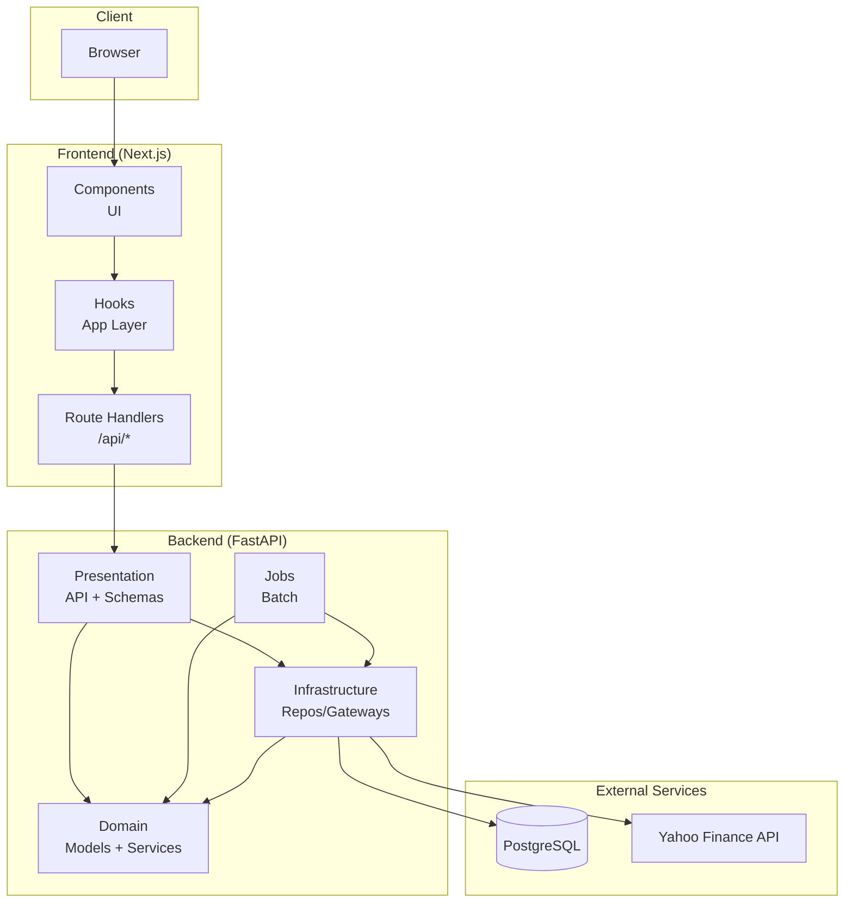
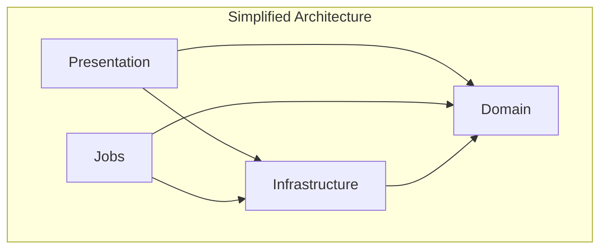
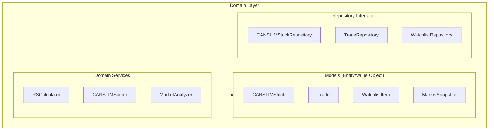
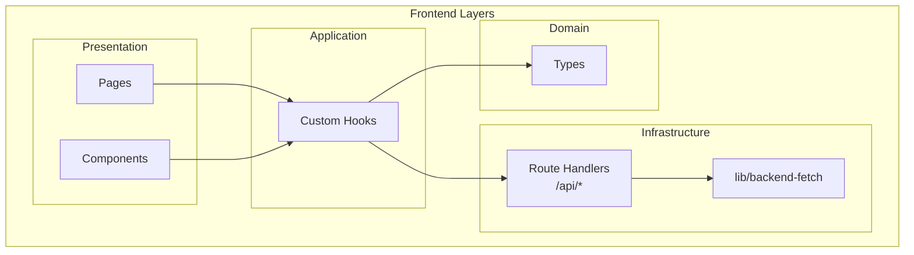
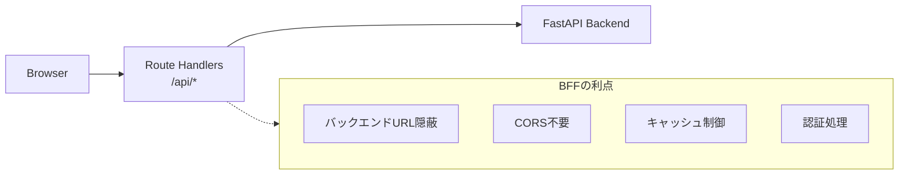
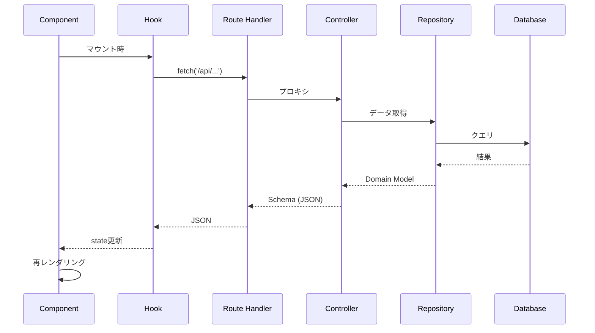
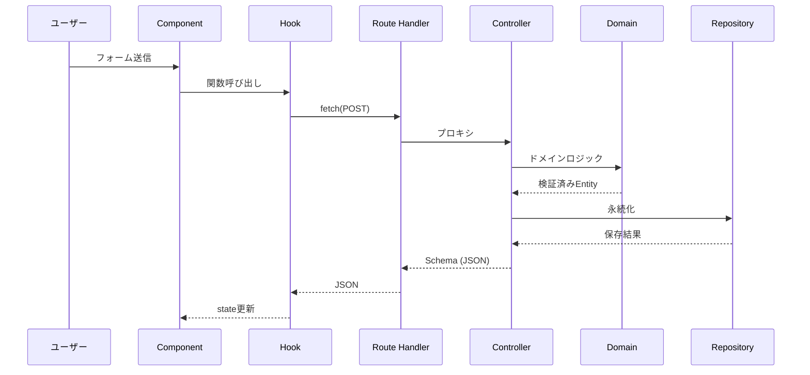
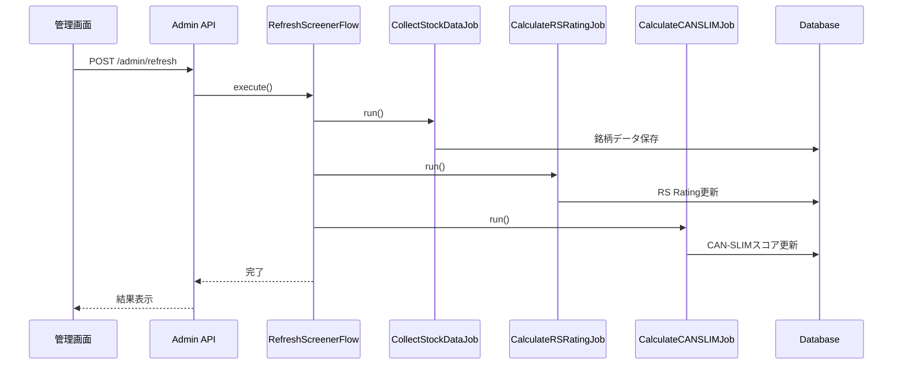
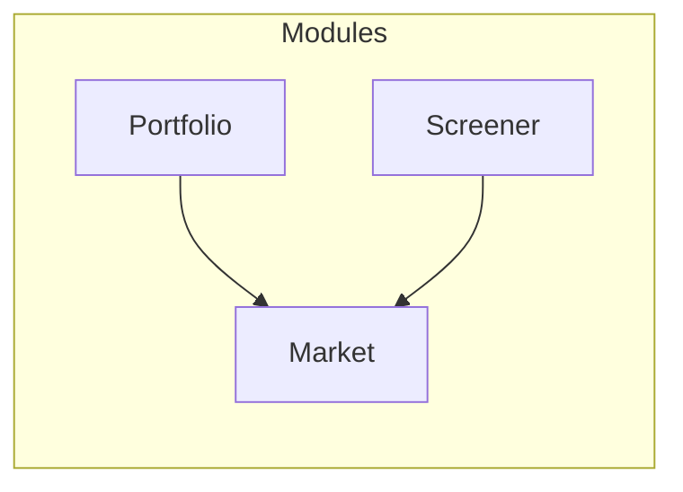

# サービスアーキテクチャ設計

## 概要

AI Trade Appは、CAN-SLIM投資法に基づく株式スクリーニングとペーパートレーディングを提供するWebアプリケーション。
バックエンドはシンプルな3層アーキテクチャ、フロントエンドはNext.js App Routerを採用。

---

## システム全体構成



---

## バックエンド アーキテクチャ

### レイヤー構成（シンプル3層）



```
src/
├── domain/           # ドメイン層（ビジネスロジック）
├── infrastructure/   # インフラ層（Repository/Gateway実装）
├── presentation/     # プレゼンテーション層（API + Schemas）
├── jobs/             # バッチ処理層
└── main.py          # エントリーポイント
```

### 各層の責務

| 層 | 責務 | 依存方向 |
|----|------|---------|
| **Domain** | ビジネスルール、モデル、ドメインサービス、Repositoryインターフェース | 依存なし（最内層） |
| **Infrastructure** | DB実装、外部API、Repository/Gateway実装 | Domain のみ |
| **Presentation** | HTTPエンドポイント、Schemas、データ変換 | Domain, Infrastructure |
| **Jobs** | バッチ処理フロー、定期実行ジョブ | Domain, Infrastructure |

### インターフェースの配置

| 種類 | インターフェース位置 | 実装位置 | 理由 |
|------|---------------------|----------|------|
| Repository | `domain/repositories/` | `infrastructure/repositories/` | Domain層がDBアクセスを抽象化 |
| Gateway | `infrastructure/gateways/` | `infrastructure/gateways/` | 実装と同居（シンプル化） |

> **設計方針**: "A Philosophy of Software Design" に基づき、浅いモジュール（pass-through層）を排除してシンプル化

---

### Domain層 詳細



```
domain/
├── models/           # モデル（Entity + Value Object を統合）
│   ├── canslim_stock.py      # CAN-SLIM銘柄
│   ├── trade.py              # トレード
│   ├── watchlist_item.py     # ウォッチリスト項目
│   ├── market_snapshot.py    # マーケットスナップショット
│   └── screening_criteria.py # スクリーニング条件
│
├── services/         # ドメインサービス
│   ├── rs_calculator.py          # RS（相対強度）計算
│   ├── rs_rating_calculator.py   # RS Rating計算
│   ├── canslim_scorer.py         # CAN-SLIMスコア計算
│   └── market_analyzer.py        # 市場分析
│
├── repositories/     # リポジトリインターフェース
│   ├── canslim_stock_repository.py
│   ├── trade_repository.py
│   ├── watchlist_repository.py
│   └── market_snapshot_repository.py
│
└── constants/        # ドメイン定数
    ├── canslim_defaults.py
    └── trading_days.py
```

### Presentation層 詳細

```
presentation/
├── api/              # APIエンドポイント（Controllers）
│   ├── screener_controller.py    # スクリーナーAPI
│   ├── portfolio_controller.py   # ポートフォリオAPI
│   ├── market_controller.py      # マーケットAPI
│   ├── data_controller.py        # データ取得API
│   └── admin_controller.py       # 管理API
│
├── schemas/          # リクエスト/レスポンススキーマ
│   ├── screener.py
│   ├── portfolio.py
│   ├── market.py
│   └── common.py
│
└── dependencies.py   # FastAPI依存性注入
```

**Controllerの責務**:
- HTTPリクエスト/レスポンス処理
- Repository/Gatewayの直接呼び出し
- Domain Model → Schema変換

### Infrastructure層 詳細

```
infrastructure/
├── repositories/     # Repository実装
│   ├── postgres_canslim_stock_repository.py
│   ├── postgres_trade_repository.py
│   ├── postgres_watchlist_repository.py
│   └── postgres_market_snapshot_repository.py
│
├── gateways/         # Gateway（インターフェース＋実装）
│   ├── financial_data_gateway.py    # Gatewayインターフェース
│   ├── yfinance_gateway.py          # yfinance実装
│   └── symbol_provider.py           # シンボルプロバイダー
│
└── database/         # DB接続
    ├── connection.py
    └── init.sql
```

### Jobs層 詳細（バッチ処理）

スクリーナーデータ更新などの長時間バッチ処理を担当。
Repository/Gatewayを直接利用するバッチ専用のオーケストレーション層。

```
jobs/
├── flows/            # フロー（複数Jobのオーケストレーション）
│   └── refresh_screener.py   # スクリーナー更新フロー
│
├── executions/       # 個別Job実行
│   ├── base.py                   # Job基底クラス
│   ├── collect_stock_data.py     # Job1: データ収集
│   ├── calculate_rs_rating.py    # Job2: RS Rating計算
│   └── calculate_canslim.py      # Job3: CAN-SLIMスコア計算
│
└── lib/              # Job共通ライブラリ
    ├── models.py         # 実行記録モデル
    └── repositories.py   # 実行記録リポジトリ
```

**Jobs層の位置づけ**:
- バッチ処理専用のオーケストレーション層
- HTTPリクエストではなく、管理画面からのトリガーで実行
- 長時間実行、段階的処理、リトライ対応
- Repository/Gatewayを直接利用

### DDDパターンの使い分け

| パターン | 使用条件 | 例 |
|---------|---------|-----|
| **Entity** | 識別子が必要、ライフサイクルがある | Trade, WatchlistItem |
| **Value Object** | 不変、値で等価性判断 | ScreeningCriteria |
| **Domain Service** | 複数オブジェクト横断、ビジネスポリシー | RSCalculator, MarketAnalyzer |
| **Repository** | 永続化の抽象化 | CANSLIMStockRepository (interface) |
| **Gateway** | 外部APIの抽象化 | FinancialDataGateway (interface) |

---

## フロントエンド アーキテクチャ

### レイヤー構成



```
src/
├── app/              # ページ & Route Handlers
│   ├── api/              # BFF (Backend For Frontend)
│   ├── portfolio/        # ポートフォリオページ
│   └── screener/         # スクリーナーページ
│
├── components/       # UIコンポーネント
│   ├── ui/               # 汎用UIパーツ
│   ├── portfolio/        # ポートフォリオ関連
│   └── screener/         # スクリーナー関連
│
├── hooks/            # カスタムフック（Application Layer）
│   ├── useWatchlist.ts
│   ├── useTrades.ts
│   └── usePerformance.ts
│
├── types/            # 型定義（Domain Layer相当）
│   ├── portfolio.ts
│   ├── stock.ts
│   └── market.ts
│
└── lib/              # ユーティリティ
    └── backend-fetch.ts  # バックエンド通信
```

### 各層の責務

| 層 | 場所 | 責務 |
|----|------|------|
| **Presentation** | `components/`, `app/*/page.tsx` | UI表示、ユーザー操作 |
| **Application** | `hooks/` | 状態管理、ユースケース調整 |
| **Infrastructure** | `app/api/`, `lib/` | API通信、外部サービス連携 |
| **Domain** | `types/` | 型定義（バックエンドのドメインモデルを反映） |

### BFF（Backend For Frontend）パターン



---

## データフロー

### 読み取り（Read）



### 書き込み（Write）



### バッチ処理（Jobs）



---

## モジュール構成

### 機能モジュール

| モジュール | 説明 | 主要モデル |
|-----------|------|-----------------|
| **Market** | 市場データ、指標 | MarketSnapshot |
| **Screener** | CAN-SLIMスクリーニング | CANSLIMStock |
| **Portfolio** | ウォッチリスト、トレード | WatchlistItem, Trade |

### 依存関係



---

## 設計原則

### バックエンド

1. **シンプルさ優先**: "A Philosophy of Software Design" に基づき、浅いモジュールを排除
2. **単一責任**: 各クラスは1つの責務のみ
3. **不変性**: Value Objectは `frozen=True` で不変に
4. **ドメイン駆動**: ビジネスロジックはDomain層に集約
5. **YAGNI**: 必要になるまで抽象化層を追加しない

### フロントエンド

1. **関心の分離**: UI（Component）とロジック（Hook）を分離
2. **型安全**: TypeScript strict mode
3. **BFFパターン**: バックエンド通信はRoute Handler経由
4. **コロケーション**: 関連ファイルは近くに配置

---

## 関連ドキュメント

- [API設計](./architectures/api-design.md)
- [データベース設計](./architectures/database-design.md)
- [ディレクトリ構造](./architectures/directory-structure.md)
- [BFFリファクタリング計画](./refactoring/frontend-api-bff.md)
- [アーキテクチャレビュー](./architecture-review.md)
