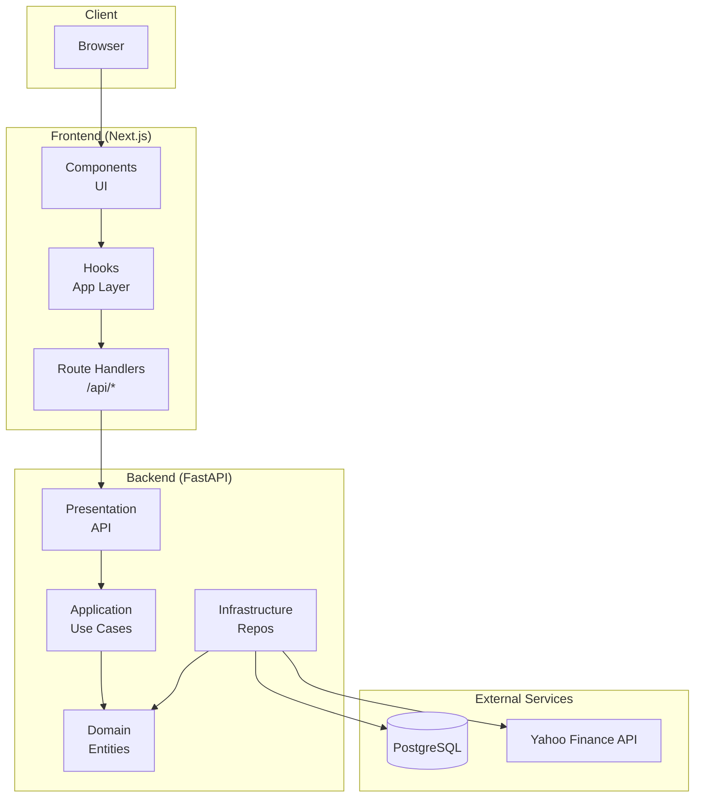
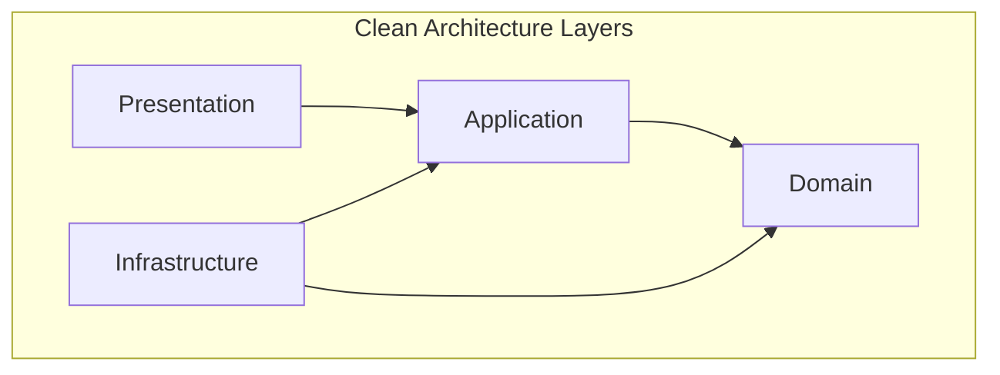
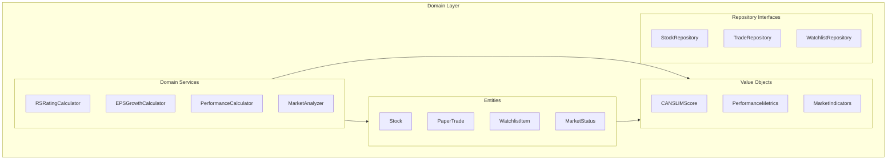
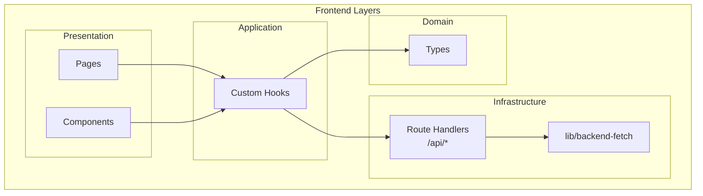
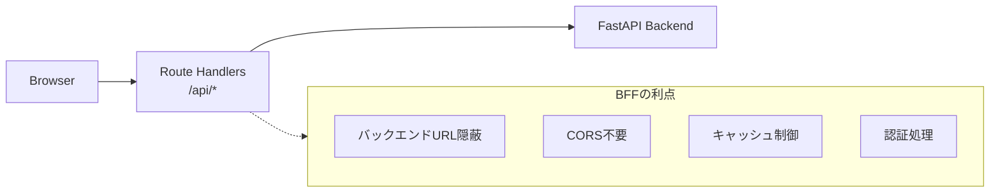
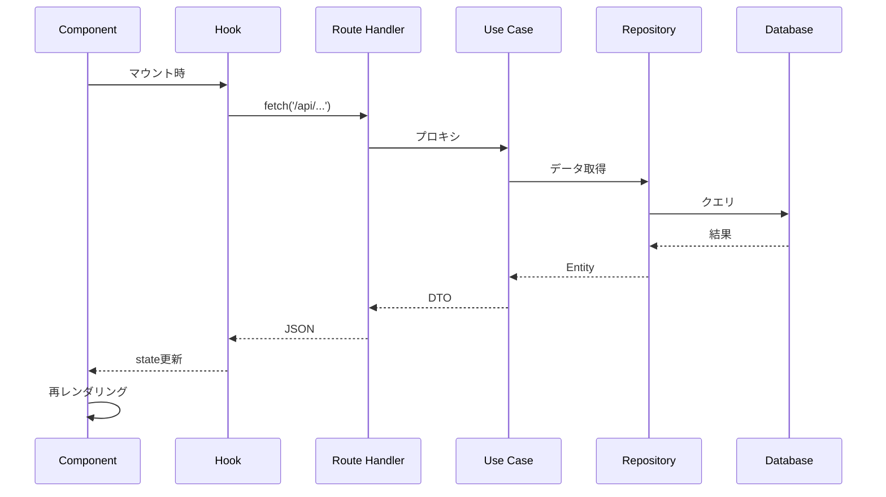
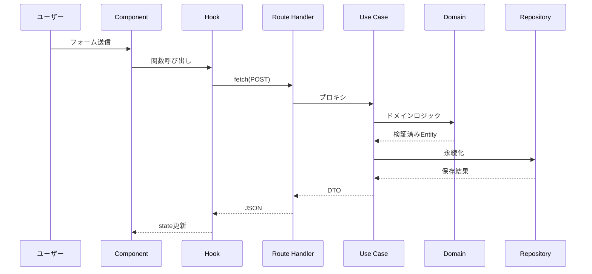
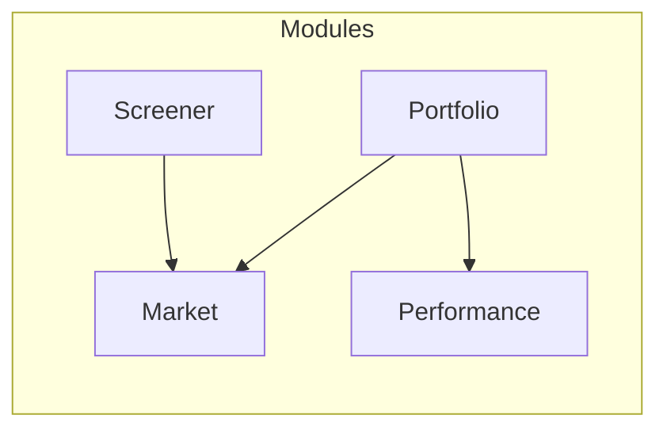

# サービスアーキテクチャ設計

## 概要

AI Trade Appは、CAN-SLIM投資法に基づく株式スクリーニングとペーパートレーディングを提供するWebアプリケーション。
バックエンドはクリーンアーキテクチャ（DDD）、フロントエンドはNext.js App Routerを採用。

---

## システム全体構成



---

## バックエンド アーキテクチャ

### レイヤー構成（クリーンアーキテクチャ）



```
src/
├── domain/           # ドメイン層（最内層）
├── application/      # アプリケーション層
├── infrastructure/   # インフラストラクチャ層
├── presentation/     # プレゼンテーション層（最外層）
└── main.py          # エントリーポイント
```

### 各層の責務

| 層 | 責務 | 依存方向 |
|----|------|---------|
| **Domain** | ビジネスルール、エンティティ、値オブジェクト | 依存なし（最内層） |
| **Application** | ユースケース、DTO、オーケストレーション | Domain のみ |
| **Infrastructure** | DB実装、外部API、リポジトリ実装 | Domain, Application |
| **Presentation** | HTTPエンドポイント、リクエスト/レスポンス | Application |

### Domain層 詳細



```
domain/
├── entities/          # エンティティ（識別子を持つオブジェクト）
│   ├── stock.py           # 銘柄
│   ├── paper_trade.py     # ペーパートレード
│   ├── watchlist_item.py  # ウォッチリスト項目
│   └── market_status.py   # マーケット状態
│
├── value_objects/     # 値オブジェクト（不変、値で比較）
│   ├── canslim_score.py       # CAN-SLIMスコア
│   ├── performance_metrics.py # パフォーマンス指標
│   └── market_indicators.py   # 市場指標
│
├── services/          # ドメインサービス（複数オブジェクト横断ロジック）
│   ├── rs_rating_calculator.py     # RS Rating計算
│   ├── eps_growth_calculator.py    # EPS成長率計算
│   ├── performance_calculator.py   # パフォーマンス計算
│   └── market_analyzer.py          # 市場分析
│
├── repositories/      # リポジトリインターフェース
│   ├── stock_repository.py
│   ├── trade_repository.py
│   └── watchlist_repository.py
│
└── constants/         # ドメイン定数
    └── canslim_thresholds.py
```

### DDDパターンの使い分け

| パターン | 使用条件 | 例 |
|---------|---------|-----|
| **Entity** | 識別子が必要、ライフサイクルがある | PaperTrade, WatchlistItem |
| **Value Object** | 不変、値で等価性判断 | CANSLIMScore, PerformanceMetrics |
| **Domain Service** | 複数オブジェクト横断、ビジネスポリシー | PerformanceCalculator, MarketAnalyzer |
| **Repository** | 永続化の抽象化 | TradeRepository (interface) |

---

## フロントエンド アーキテクチャ

### レイヤー構成



```
src/
├── app/              # ページ & Route Handlers
│   ├── api/              # BFF (Backend For Frontend)
│   ├── portfolio/        # ポートフォリオページ
│   └── screener/         # スクリーナーページ
│
├── components/       # UIコンポーネント
│   ├── ui/               # 汎用UIパーツ
│   ├── portfolio/        # ポートフォリオ関連
│   └── screener/         # スクリーナー関連
│
├── hooks/            # カスタムフック（Application Layer）
│   ├── useWatchlist.ts
│   ├── useTrades.ts
│   └── usePerformance.ts
│
├── types/            # 型定義（Domain Layer相当）
│   ├── portfolio.ts
│   ├── stock.ts
│   └── market.ts
│
└── lib/              # ユーティリティ
    └── backend-fetch.ts  # バックエンド通信
```

### 各層の責務

| 層 | 場所 | 責務 |
|----|------|------|
| **Presentation** | `components/`, `app/*/page.tsx` | UI表示、ユーザー操作 |
| **Application** | `hooks/` | 状態管理、ユースケース調整 |
| **Infrastructure** | `app/api/`, `lib/` | API通信、外部サービス連携 |
| **Domain** | `types/` | 型定義（バックエンドのドメインモデルを反映） |

### BFF（Backend For Frontend）パターン



---

## データフロー

### 読み取り（Read）



### 書き込み（Write）



---

## モジュール構成

### 機能モジュール

| モジュール | 説明 | 主要エンティティ |
|-----------|------|-----------------|
| **Market** | 市場データ、指標 | MarketStatus, Quote |
| **Screener** | CAN-SLIMスクリーニング | Stock, CANSLIMScore |
| **Portfolio** | ウォッチリスト、トレード | WatchlistItem, PaperTrade |
| **Performance** | パフォーマンス分析 | PerformanceMetrics |

### 依存関係



---

## 設計原則

### バックエンド

1. **依存性逆転**: 内層は外層に依存しない（Repository Interface）
2. **単一責任**: 各クラスは1つの責務のみ
3. **不変性**: Value Objectは `frozen=True` で不変に
4. **ドメイン駆動**: ビジネスロジックはDomain層に集約

### フロントエンド

1. **関心の分離**: UI（Component）とロジック（Hook）を分離
2. **型安全**: TypeScript strict mode
3. **BFFパターン**: バックエンド通信はRoute Handler経由
4. **コロケーション**: 関連ファイルは近くに配置

---

## 関連ドキュメント

- [API設計](./architectures/api-design.md)
- [データベース設計](./architectures/database-design.md)
- [ディレクトリ構造](./architectures/directory-structure.md)
- [BFFリファクタリング計画](./refactoring/frontend-api-bff.md)
- [アーキテクチャレビュー](./architecture-review.md)
